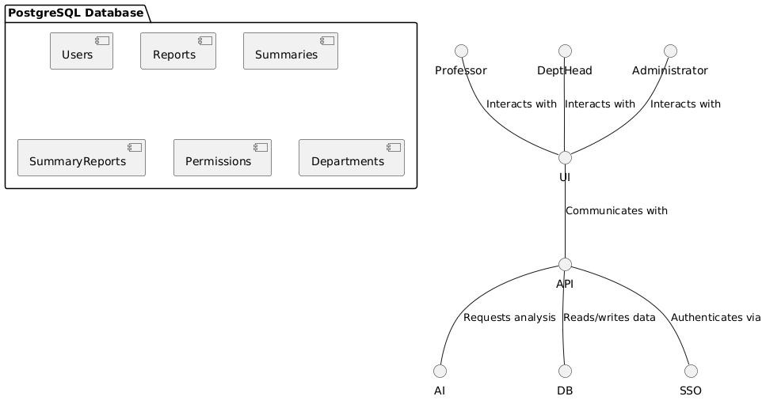

# **High-Level Design Document**

## **Table of Contents**

1. [Introduction and Definitions](#1-introduction-and-definitions)
   - [1.1 Purpose](#11-purpose)
   - [1.2 Definitions and Acronyms](#12-definitions-and-acronyms)
   - [1.3 Background Information](#13-background-information)
2. [Design Considerations](#2-design-considerations)
   - [2.1 Scope](#21-scope)
   - [2.2 Assumptions](#22-assumptions)
   - [2.3 Dependencies](#23-dependencies)
   - [2.4 Constraints](#24-constraints)
3. [User Interfaces](#3-user-interfaces)
   - [3.1 Simple Workflow](#31-simple-workflow)
   - [3.2 Key Functions](#32-key-functions)
   - [3.3 Progress Indicators](#33-progress-indicators)
   - [3.4 Customization Options](#34-customization-options)
   - [3.5 Responsive Design](#35-responsive-design)
   - [3.6 Cross-Browser Compatibility](#36-cross-browser-compatibility)
   - [3.7 Compliance with WCAG 2.1](#37-compliance-with-wcag-21)
   - [3.8 Color Contrast and Legibility](#38-color-contrast-and-legibility)
4. [Data Design](#4-data-design)
   - [4.1 Database Schema](#41-database-schema)
     - [4.1.1 Users Table](#411-users-table)
     - [4.1.2 Reports Table](#412-reports-table)
     - [4.1.3 Summaries Table](#413-summaries-table)
     - [4.1.4 SummaryReports Table](#414-summaryreports-table)
     - [4.1.5 Permissions Table](#415-permissions-table)
     - [4.1.6 Departments Table](#416-departments-table)
   - [4.2 Data Flow](#42-data-flow)
     - [4.2.1 Data Upload and Storage](#421-data-upload-and-storage)
     - [4.2.2 AI Processing and Summary Generation](#422-ai-processing-and-summary-generation)
     - [4.2.3 Data Retrieval and Reporting](#423-data-retrieval-and-reporting)
   - [4.3 AI Implementation](#43-ai-implementation)
     - [4.3.1 System 1: Small Language Model (SLM) with LoRa Fine-Tuning](#431-system-1-small-language-model-slm-with-lora-fine-tuning)
     - [4.3.2 System 2: Base Language Model with Custom Instructions](#432-system-2-base-language-model-with-custom-instructions)
     - [4.3.3 System 3: Proprietary AI Model via API (e.g., ChatGPT)](#433-system-3-proprietary-ai-model-via-api-eg-chatgpt)
     - [4.3.4 Comparative Analysis of AI Systems](#434-comparative-analysis-of-ai-systems)
     - [4.3.5 Recommended Approach](#435-recommended-approach)
   - [4.4 Data Privacy and Security](#44-data-privacy-and-security)
   - [4.5 Data Backup and Recovery](#45-data-backup-and-recovery)
   - [4.6 Scalability Considerations](#46-scalability-considerations)
   - [4.7 High Level UML Diagram](#47-high-level-uml-diagram) 
5. [API Interactions](#5-api-interactions)
6. [Security Considerations](#6-security-considerations)
7. [Deployment Considerations](#7-deployment-considerations)
   - [7.1 Platform](#71-platform)
   - [7.2 Hosting](#72-hosting)
   - [7.3 Environments](#73-environments)
   - [7.4 Continuous Integration and Deployment (CI/CD)](#74-continuous-integration-and-deployment-cicd)
8. [Conclusion](#8-conclusion)

## **1. Introduction and Definitions**

### **1.1 Purpose**
The purpose of this project is to allow professors to distill many years of qualitative feedback in their courses into a quick and effective summary using AI. This will assist teachers by helping them quickly receive feedback from what could be hundreds of students each semester/course without spending hours reading through each individual comment.

### **1.2 Definitions and Acronyms**
- **SSO**: Single Sign-On
- **PDF**: Portable Document Format
- **IDEA**: **I**ndividual **D**evelopment and **E**ducational **A**ssessment evaluation survey used at USU 
- [**FERPA**](https://www.usu.edu/registrar/records/control/ferpa): Family Educational Rights and Privacy Act

### **1.3 Background Information**
1. **Use of IDEA surveys**:
   - Our system leverages the IDEA (Individual Development and Educational Assessment) Surveys, which are commonly used to gather student feedback on courses and instructors. These surveys provide both quantitative data (e.g., numeric ratings) and qualitative data (e.g., written comments). This software specifically focuses on interpreting the **qualitative** data. By analyzing the qualitative feedback from the IDEA surveys, our system aims to produce clear, actionable summaries that highlight key themes such as course strengths, areas for improvement, and overall sentiment. 

---

## **2. Design Considerations**

### **2.1 Scope**
1. **AI-Driven Summarization of Student Feedback:**
   - Automatically generate summaries of qualitative comments from IDEA survey reports.
   - Allow professors to input custom questions for more targeted insights.

2. **User Authentication:**
   - Professors log in using Utah State University’s Single Sign-On (SSO) system.
   - Admins (e.g., department chairs) can have permission-based access to view reports of the professors they oversee.

3. **Report Filtering and Generation:**
   - Filter feedback by class and time period.
   - Aggregate feedback across multiple semesters for trend detection.
   - Export reports in various formats such as PDF, CSV, and DOCX.

4. **Content Moderation:**
   - Filter out aggressive or inappropriate comments in student feedback.
   - Provide a toggle for professors to enable or disable content moderation.

5. **System Accessibility and User Interface:**
   - Ensure a user-friendly, intuitive interface for non-technical users.
   - Ensure multi-browser compatibility.
   - Comply with accessibility standards (e.g., for visually impaired users).

6. **Data Privacy and Security:**
   - Adhere to FERPA regulations and USU's data privacy policies.
   - Ensure role-based access control and encryption of sensitive data.

7. **Audit and Logging:**
   - Track usage and interactions for admins (e.g., login attempts, generations per person).

### **2.2 Assumptions**
1.  **User Knowledge**
      - We assume that the Professor, Department Head, and Administrator all know the purpose of what IDEA surveys do. 
      - Professors, Department Head, and Administrator are familiar with the SSO system for secure login.
      - We must assume that users may not be tech savvy

### **2.3 Dependencies**

1. **SSO Authentication System**
   - The system relies on Utah State University’s **Single Sign-On (SSO)** system for user authentication. Any issues with the SSO system (e.g., downtime or changes in authentication protocols) may impact the users' ability to access the system.
   - The SSO integration is assumed to continue being supported by the University's IT infrastructure without needing major changes to the authentication window.
   - The security of SSO is vial to ensuring user data and access rights are maintained securely

2. **AI Model**
   - The core functionality of the system depends on an external **AI model** for analyzing and summarizing qualitative data from IDEA surveys. 
   - The system requires that this AI model continues to function as intended and be available for use.
   - If the AI model updates, we must ensure that cross over compatibility is still accurate and relevent.
   - The AI's performance may vary depending on traffic of the AI during peak usage periods.

3. **Data Storage**
   - The system requires a reliable and secure data storage to store our IDEA survey data and the generated AI summaries. This storage infrastructure must be accessible and maintained to ensure smooth system operation.
   - Data storage must comply with FERPA and other privacy regulations, with proper encryption and access control

4. **Continued Use of IDEA Surveys**
   - The system depends on the ongoing use of IDEA surveys by Utah State University to gather student feedback. Any change or discontinuation of IDEA surveys would require modifications to the system to accommodate new feedback mechanisms.
   - Changes to the structure of how we get IDEA survey qualitative data would necessitate how the data is processed and analyzed.

### **2.4 Constraints**
1. **FERPA Compliance**:
   - The system must adhere to **FERPA regulations**, ensuring the privacy of user data and implementing secure role-based access controls.
   - Role-based access control must be implemented, allowing only authorized personnel (e.g., professors, department heads) to access specific feedback and reports.
   - Data sharing with external services (e.g., the AI model) must be done securely, and no personally identifiable information (PII) of students should be transmitted unnecessarily.
  
2. **Content Moderation** 
   - The system must filter out inappropriate feedback, such as offensive or harmful comments, before it is displayed to professors, ensuring that only constructive feedback is shown.
   - The AI model must be trained or programmed to identify and flag inappropriate comments for review or discard.
   - Content moderation must be done in a way that ensures sensitive or emotional comments are handled appropriately, protecting professors from potential emotional distress.

3. **Data Dependency**
   - The system is dependent on the **quality of data** provided by the IDEA surveys. Inconsistent, incomplete, or poor-quality feedback may affect the accuracy and usefulness of AI-generated summaries.
   - If the survey data is missing or incorrect, the system may not be able to generate accurate or meaningful reports.

4. **System Availability**
   - The system’s availability and performance are constrained by external dependencies, such as the availability of the **SSO system**, **AI service**, and **data storage infrastructure**. Any downtime in these services will directly impact the system's functionality.
   - Maintenance, updates, or outages in third-party services may temporarily limit system functionality.

5. **Scalability**
   - While the system is designed for current usage levels, future scalability may require additional resources (e.g., AI processing power, data storage) if usage increases significantly, particularly during peak times (e.g., end of semester).
   - Scalability concerns must be addressed if the system is adopted by many departments at the university, potentially increasing the volume of data processed.

6. **Data Security**
   - All data processed by the system, including **student feedback** and **AI-generated summaries**, must be encrypted both **in transit** and **at rest** to ensure data security and protect sensitive information.
   - The system must implement strict access controls, ensuring that only authorized personnel can access or modify data.

7. **User Access Rights**
   - The system must enforce role-based access controls, meaning professors can only access data relevant to their own classes. Department Heads and Administrators may have access to broader datasets, but access rights must be carefully managed to prevent unauthorized access.

8. **Processing time**
   - The AI models processing time is largely influenced by the size of the feedback data. Which means generating reports will take longer in some cases. 
   - System should provide feedback on processing status and completion

---

## **3. User Interfaces**

### **Intuitive Interface**

#### **3.1 Simple Workflow**
The user interface is designed with a primary focus on simplicity and ease of use, ensuring that even non-technical users, such as professors who may not have extensive technical experience, can navigate the platform with minimal effort. The interface will offer a logical flow of actions, guiding users step-by-step through the process of generating feedback summaries, reducing potential confusion or errors.

#### **3.2 Key Functions**
- **Logging in**: User authentication will be handled through Utah State University’s Single Sign-On (SSO) system, which most faculty members are already familiar with. This will streamline the login process, eliminating the need for new credentials and reducing potential barriers to access. Professors will simply use their existing USU credentials to gain access to the system.
  
- **IDEA Survey PDFs**: The system will automatically retrieve IDEA survey reports from a centralized database, eliminating the need for professors to manually upload their own documents. This backend process will be invisible to the user, ensuring that the experience is seamless and requires minimal input. By reducing the need for manual data handling, the system minimizes the potential for errors or delays caused by incorrect uploads.

- **Requesting Summaries**: Professors will be able to generate AI-powered feedback summaries using intuitive, clearly labeled buttons, prompts, and drop-down menus. Key actions, such as requesting a summary, will be highlighted in the interface to ensure they are easily identifiable. The system will provide users with the flexibility to generate summaries for specific time periods, courses, or custom queries without overwhelming them with unnecessary complexity.

#### **3.3 Progress Indicators**
The platform will provide real-time feedback on ongoing processes through visual indicators. For example, when professors request feedback summaries, they will see progress bars for uploads and AI processing times. Depending on the length of the report and the complexity of the request, status messages will display estimated completion times, keeping users informed throughout the entire process. This transparency helps manage user expectations and reduces uncertainty during long-running operations.

#### **3.4 Customization Options**
Professors will be able to tailor feedback summaries to meet their specific needs. Customization options will include:
- **Date Range Filters**: Professors can narrow their feedback summaries by selecting specific semesters or academic years.
- **Class Filters**: They can choose to generate summaries for individual courses or aggregate feedback across multiple classes to identify broader trends.
   - Class filters will include options for sections. 
- **Custom Questions**: Professors can input specific questions or topics of interest, allowing the AI to generate more focused summaries based on the custom parameters they provide. This feature enhances the relevance and usefulness of the generated insights.
   - There will be predetermined options for the questions.
- **Export Choices**:
   - Faculty will have options to export the response into PDF format. 

### **Mobile and Desktop Support**

#### **3.5 Responsive Design**
The web app will be built using a responsive design framework to ensure that it works optimally across a range of devices, including desktops, laptops, tablets, and smartphones. The layout and components will automatically adjust to fit different screen sizes, providing a consistent, user-friendly experience on any device. Professors will be able to access the system whether they are working from a desktop computer in their office or reviewing feedback on a mobile device while on the go.

#### **3.6 Cross-Browser Compatibility**
The platform will be compatible with all major web browsers, including Chrome, Firefox, Safari, and Edge. This ensures that regardless of the browser being used, users will experience the same seamless functionality without encountering display or performance issues. The interface will undergo thorough testing across these browsers to prevent inconsistencies that could interfere with the user experience.

### **Accessibility**

#### **3.7 Compliance with WCAG 2.1**
Accessibility is a priority in the design of the platform, ensuring that all users, including those with disabilities, can effectively navigate and utilize the system. The interface will comply with Web Content Accessibility Guidelines (WCAG) 2.1, incorporating features such as:
- **Screen Reader Compatibility**: For users who rely on screen readers, the platform will be fully navigable, with appropriate semantic markup and alternative text for non-text content.
- **Keyboard Navigation**: Users will be able to navigate the interface entirely via keyboard if necessary, with focus indicators and logical tab orders.
   - Most faculty will just use the mouse.

#### **3.8 Color Contrast and Legibility**
All design elements will adhere to the official Utah State University color style guide, ensuring visual consistency with institutional branding while maintaining accessibility standards.

---

## **4. Data Design**

The Data Design section outlines the structure and management of data within the system, ensuring efficient storage, retrieval, and processing of information. This section details the database schema, data flow, and the implementation of the AI systems used for summarizing student feedback.

### **4.1 Database Schema**

The system will utilize **PostgreSQL** as the relational database management system due to its robustness, scalability, and support for complex queries. The database schema is designed to efficiently store and manage user information, IDEA survey reports, AI-generated summaries/data, and role-based permissions. Below is an outline of the primary tables and their relationships:

#### **4.1.1 Users Table**
Stores information about professors, department heads, and administrators. Authentication is managed externally via Utah State University’s Single Sign-On (SSO) system, so sensitive authentication data is not stored within this table.

| Column Name | Data Type | Constraints | Description |
|-------------|-----------|-------------|-------------|
| `user_id`   | SERIAL    | PRIMARY KEY | Unique identifier for each user |
| `sso_id`    | VARCHAR   | UNIQUE, NOT NULL | Identifier from the SSO system |
| `email`     | VARCHAR   | UNIQUE, NOT NULL | User's email address |
| `role`      | VARCHAR   | NOT NULL (ENUM: 'professor', 'dept_head', 'admin') | User's role within the system |
| `created_at`| TIMESTAMP | DEFAULT CURRENT_TIMESTAMP | Timestamp of account creation |
| `updated_at`| TIMESTAMP | DEFAULT CURRENT_TIMESTAMP | Timestamp of last account update |

#### **4.1.2 Reports Table**
Stores metadata about uploaded IDEA survey reports.

| Column Name | Data Type | Constraints | Description |
|-------------|-----------|-------------|-------------|
| `report_id` | SERIAL    | PRIMARY KEY | Unique identifier for each report |
| `user_id`   | INTEGER   | FOREIGN KEY REFERENCES Users(user_id) | ID of the professor associated with the report |
| `course_id` | VARCHAR   | NOT NULL | Identifier for the course |
| `semester`  | VARCHAR   | NOT NULL | Semester during which the course was taught |
| `year`      | INTEGER   | NOT NULL | Academic year of the course |
| `file_path` | VARCHAR   | NOT NULL | Storage path of the uploaded PDF |
| `uploaded_at`| TIMESTAMP | DEFAULT CURRENT_TIMESTAMP | Timestamp of when the report was uploaded |

#### **4.1.3 Summaries Table**
Stores AI-generated summaries and related interaction logs. Each summary can be associated with multiple reports, enabling professors to request comprehensive summaries spanning different time periods or specific courses.

| Column Name      | Data Type | Constraints | Description |
|------------------|-----------|-------------|-------------|
| `summary_id`     | SERIAL    | PRIMARY KEY | Unique identifier for each summary |
| `user_id`        | INTEGER   | FOREIGN KEY REFERENCES Users(user_id) | ID of the professor who requested the summary |
| `summary_text`   | TEXT      | NOT NULL | The generated summary text |
| `sentiment_score`| FLOAT     | NOT NULL | Overall sentiment score derived from feedback |
| `created_at`     | TIMESTAMP | DEFAULT CURRENT_TIMESTAMP | Timestamp of when the summary was created |
*Other data besides just summaries and sentiments may be collected*

#### **4.1.4 SummaryReports Table**
Manages the many-to-many relationship between Summaries and Reports, allowing each summary to be associated with multiple reports and vice versa.

| Column Name | Data Type | Constraints | Description |
|-------------|-----------|-------------|-------------|
| `summary_id` | INTEGER   | FOREIGN KEY REFERENCES Summaries(summary_id) | ID of the summary |
| `report_id`  | INTEGER   | FOREIGN KEY REFERENCES Reports(report_id) | ID of the report |
| **Primary Key** | (`summary_id`, `report_id`) | | Composite primary key to ensure uniqueness |

#### **4.1.5 Permissions Table**
Manages role-based access control for department heads and administrators.

| Column Name     | Data Type | Constraints | Description |
|-----------------|-----------|-------------|-------------|
| `permission_id` | SERIAL    | PRIMARY KEY | Unique identifier for each permission |
| `user_id`       | INTEGER   | FOREIGN KEY REFERENCES Users(user_id) | ID of the user with specific permissions |
| `department_id` | VARCHAR   | NOT NULL | Identifier for the department |
| `access_level`  | VARCHAR   | NOT NULL (ENUM: 'view', 'edit', 'admin') | Level of access granted |

#### **4.1.6 Departments Table**
(Optional) Stores information about different departments within the university.

| Column Name     | Data Type | Constraints | Description |
|-----------------|-----------|-------------|-------------|
| `department_id` | SERIAL    | PRIMARY KEY | Unique identifier for each department |
| `name`          | VARCHAR   | UNIQUE, NOT NULL | Name of the department |

### **4.2 Data Flow**

The data flow within the system encompasses the journey of IDEA survey reports from upload to the generation of AI-powered summaries, and finally, the retrieval of these summaries by professors.

#### **4.2.1 Data Upload and Storage**
1. **Report Upload:**
   - Professors log in using the USU SSO system.
   - They navigate to the upload section and submit their IDEA survey reports in PDF format.
   *This assumes professors need to upload their reports manually.*
   
2. **Backend Processing:**
   - The **Upload API** receives the PDF and stores it in a secure file storage system.
   - Metadata about the report (such as `course_id`, `semester`, `year`) is extracted and stored in the **Reports Table**.

#### **4.2.2 AI Processing and Summary Generation**
1. **Triggering AI Processing:**
   - A professor can choose to generate a summary of a specific report or group of reports (Filtering may be done through criteria such as time period, speicifc course, etc.)
   
2. **Data Analysis:**
   - The AI system analyzes the qualitative feedback, performing tasks such as summarization and sentiment analysis. This will be done through one of the below potential systems (This has not yet been decided).
     1. LoRa fine-tuned models loaded for specific tasks.
     2. A base SLM with custom instructions.
     3. A proprietary AI model via API (Also with custom instructions dependent on task).
   
3. **Summary Creation:**
   - The AI generates a summary report, which includes overall summaries, sentiment scores, and potentially other releavnt data.
   - The summary is stored in the **Summaries Table**.
   - The association between the summary and the relevant reports is managed through the **SummaryReports Table**.

#### **4.2.3 Data Retrieval and Reporting**
1. **Generating Reports:**
   - Professors can request summaries through the user interface, applying filters such as date range or course.
   
2. **Fetching Summaries:**
   - Professors may choose to access previously generated summaries through the user interface.
   
3. **Exporting Reports:**
   - Summaries can be exported in formats like PDF, CSV, or DOCX via the **Download API**.
   - The exported reports are accessible through the user interface for professors to review and download.
   
4. **Access Control:**
   - Role-based access ensures that professors can only access their own summaries and associated reports, while department heads and administrators can access broader datasets as per their permissions.

### **4.3 AI Implementation**

The AI component is central to the system's functionality, responsible for analyzing and summarizing qualitative student feedback. Three potential AI systems are being explored, each with its own set of advantages and implementation complexities. The choice among these systems will impact the system's performance, scalability, and maintenance.

#### **4.3.1 System 1: Small Language Model (SLM) with LoRa Fine-Tuning**

**Description:**
- Utilizes a small language model (e.g., phi3.5 mini) as the primary summarizing engine.
- Employs **LoRa (Low-Rank Adaptation)** fine-tuned modules for specific tasks such as sentiment analysis.
- Task-specific models are swapped by hotswapping LoRAs instead of loading entire new models, enhancing speed and efficiency.

**Advantages:**
- **Customization:** High degree of customization for specific tasks through fine-tuning.
- **Performance:** Potentially more accurate and tailored results for sentiment analysis and other specialized tasks.
- **Efficiency:** Faster task switching via LoRa swapping reduces latency.

**Challenges:**
- **Implementation Complexity:** Requires in model fine-tuning and management of multiple LoRa modules.
- **Resource Intensive:** Even though SLMs are smaller, managing multiple LoRa modules can increase resource usage.
- **Challenges of small models:** For summarization specifically, smaller models may be more prone to hallucinations and other sub-optimal behaviours.

**Implementation Details:**
- **Model Integration:** The base SLM is integrated into the backend, with LoRa modules loaded as needed for specific tasks.
- **Task Management:** A task manager oversees the swapping of LoRa modules based on the requested operation (e.g., sentiment analysis, summarization).
- **Output Restriction:** The softmax layer restricts outputs for task-specific models to ensure appropriate data types (e.g., sentiment probabilities).
- **Temperature Settings:** Set to zero for data analysis tasks to ensure deterministic outputs, and non-zero for summarization to allow variability in summaries if professors choose to re-generate for better results.

#### **4.3.2 System 2: Base Language Model with Custom Instructions**

**Description:**
- Employs a same small language model (SLM) similar to System 1 but without any LoRa fine-tuning.
- The base model handles all tasks by receiving different custom instructions tailored to each specific operation.

**Advantages:**
- **Simplicity:** Easier to implement since it avoids the complexity of creating multiple fine-tuned models and swapping LoRas.
- **Maintenance:** Lower maintenance overhead as only the base model needs to be managed.
- **Cost-Effective:** Reduces resource usage by eliminating the need for multiple LoRa modules to be hotswapped.

**Challenges:**
- **Performance:** May yield slightly less accurate or less tailored results for specialized tasks compared to System 1.
- **Flexibility:** Limited customization for specific tasks, relying solely on prompt engineering.

**Implementation Details:**
- **Model Integration:** The base SLM is configured to accept task-specific instructions directly.
- **Task Handling:** Custom instructions are dynamically generated based on the requested operation (e.g., summarization, sentiment analysis).
- **Output Restriction:** Similar to System 1, the softmax layer is used to restrict outputs for specific tasks (This may take a more limited form, such as simply ignoring all output neurons besides the ones relevant to the task).
- **Temperature Settings:** Consistent with System 1, temperature is set to zero for data analysis and non-zero for summarization.

#### **4.3.3 System 3: Proprietary AI Model via API (e.g., ChatGPT)**

**Description:**
- Leverages a proprietary AI model accessed through an external API, such as OpenAI's ChatGPT.
- All AI processing is handled externally, with the system sending data to the API and receiving processed summaries.

**Advantages:**
- **Ease of Implementation:** Simplifies AI integration by outsourcing all AI tasks to a managed service.
- **Scalability:** Proprietary APIs are typically more scalable and cost-effective than local solutions. Scaling to more users simply requires paying for more tokens.

**Challenges:**
- **Cost:** Potentially higher operational costs due to API usage fees, especially with high volumes of data.
- **Customization Limitations:** Limited control over model customization and fine-tuning, restricting task-specific optimizations.
- **Dependency:** Reliance on third-party services always introduces dependency risks, such as API downtime or changes in service terms.
- **Data Privacy:** Sending data to external services may raise concerns about data privacy and compliance, necessitating strict adherence to FERPA regulations.

**Implementation Details:**
- **API Integration:** The backend communicates with the proprietary AI service via secure API calls, sending necessary data for processing.
- **Data Handling:** The specific proprietary AI model must be chosen based on how companies handle user data to ensure it is FERPA compliant and that messages won't be used for training purposes.
- **Response Management:** Received summaries and sentiment scores are parsed and stored in the **Summaries Table**.
- **Configuration:** Parameters such as temperature are set appropriately based on the task (zero for analysis, non-zero for summarization) if such options are available by the provider.

### **4.3.4 Comparative Analysis of AI Systems**

| Feature                       | System 1: SLM with LoRa | System 2: Base SLM | System 3: Proprietary API |
|-------------------------------|-------------------------|--------------------|---------------------------|
| **Implementation Complexity**| High                    | Medium             | Low                       |
| **Customization**             | High                    | Medium             | Low                       |
| **Performance**               | High                    | Medium             | Variable                  |
| **Maintenance**               | High                    | Medium             | Low                       |
| **Cost**                      | Moderate                | Lower              | Variable                      |
| **Scalability**               | Moderate                | Moderate           | High                      |
| **Data Privacy**              | High (Local Processing)| High (Local Processing)| Variable (Depends on API Provider) |
| **Dependency**                | Low                     | Low                | High                      |

### **4.3.5 Recommended Approach**

Given the project's objectives and constraints, **System 1** is the preferred choice despite its higher implementation complexity. The reasons include:

- **Customization and Performance:** System 1 offers the highest level of customization and potentially better performance for specific tasks like sentiment analysis.
  
- **Data Privacy:** Processing data locally ensures strict adherence to FERPA regulations, mitigating risks associated with sending sensitive data to external services.
  
- **Efficiency:** The ability to hotswap LoRa modules allows for efficient task management, enhancing the system's responsiveness and user experience.

- **Learning Experience:** System 1 provides the best overall learning experience being more hands on and invloved than the other options, which is appealing from the perspective of a team who loves to learn new things!

However, the team is still considering the resources and expertise required to implement and maintain System 1. If resource constraints become a significant barrier, **System 2** serves as a viable alternative as well due to offering a balance between customization and implementation simplicity. **System 3** is considered only if rapid deployment with minimal maintenance is prioritized over customization and cost, or if other aspects of the project become too demanding on our time and resources.

### **4.4 Data Privacy and Security**

The system incorporates multiple layers of security measures aligned with FERPA regulations:

- **Data Encryption:** All data - both in transit and at rest - is encrypted using industry-standard protocols.
  
- **Access Controls:** Strict role-based access controls (RBAC) is enforced, ensuring that users can only access data pertinent to their roles.
  
- **Audit Trails:** Comprehensive logging of all data access and processing activities is maintained to facilitate audits and monitor for unauthorized access attempts.

### **4.5 Data Backup and Recovery**

To safeguard against data loss and ensure system resilience, the following strategies are employed:

- **Regular Backups:** Automated backups of the PostgreSQL database are performed daily, with incremental backups every hour.

### **4.6 Scalability Considerations**

The data architecture is designed to accommodate future growth in data volume and user base:

- **Database Optimization:** The database has been designed efficiently to ensure efficient data retrieval as the dataset grows.
  
- **AI Processing:** In the case of SLMs, they are small and easy to process, making scaling them to more user releatively easy. Scaling using a proprietary model would be as simple as paying for more tokens.
  
- **Cloud Integration:** Leveraging cloud-based services for storage and processing can facilitate seamless scaling without significant architectural changes if needed.

### **4.7 High Level UML Diagram**

---

## **5. API Interactions**

- **Login API**: Authentication will be handled via the USU SSO system, with the API facilitating secure login sessions for professors and department heads.
- **Upload API**: Professors will upload PDF versions of IDEA reports via the frontend, which will be managed by an API that sends the reports to the backend for storage and processing.
- **Summarization API**: The AI engine will be accessed via an external API that processes the feedback data and returns summarized reports. The API will handle both text processing and custom queries.
- **Download API**: Professors will download the summarized reports in various formats (PDF, CSV, DOCX) through an API endpoint, ensuring ease of use and accessibility.

---

## **6. Security Considerations**

- **Compliance with FERPA**: All user data, including feedback and credentials, must comply with FERPA regulations. User information must be encrypted both in transit and at rest using modern encryption standards (e.g., AES-256).
- **Role-Based Access Control (RBAC)**: Professors will only have access to their own feedback data, while department heads may access reports of the professors they oversee. Role-based permissions will be enforced.
- **Audit Logs**: The system will log user interactions (e.g., logins, report generation) for auditing purposes, ensuring that unauthorized access attempts are tracked.

---

## **7. Deployment Considerations**

### **7.1 Platform**

#### **7.1.1 Frontend**
Because the frontend uses client-side rendering, it will consist of static HTML, CSS, and JS resources that are pre-built either locally or on a CI/CD pipeline and then served over a CDN.

#### **7.1.2 Backend**
The backend for our MVP will be a single Linux machine that runs an HTTP server. SSL will either be handled on the machine itself or on a managed load balancer that is placed in front of the machine. It will be possible to run several instances of the HTTP server in parallel so that scaling remains an option in the future.

It is possible that the server logic will be containerized (e.g., using Docker) to allow for easier deployments and rollbacks, although this design decision will be made after finalizing the server stack (language, framework, etc.).

#### **7.1.3 Database**
A managed database solution that is not internet-facing will be accessible by the backend.

### **7.2 Hosting**
The different components of the application outlined above will be hosted on USU’s internal servers or on a secure cloud platform, with the following criteria being the primary concerns when selecting the final hosting solution:
- Availability: target of 98% uptime
- Security
- Price
- Scalability
  - Note that although this is not a concern at launch, it is important that a hosting provider offers the tools and services that would enable scaling down the road.

### **7.3 Environments**
A working production deployment is out of scope at this point in time while we work to develop an MVP that can be demoed as a proof of concept to relevant stakeholders. Limiting our focus to a single environment will reduce the burden of menial dev-ops tasks on developers and better facilitate rapid iteration. As such, we will deploy to a single environment known as `dev`.

### **7.4 Continuous Integration and Deployment (CI/CD)**
- Implement a CI/CD pipeline for automated testing, deployment, and updates.

---

## **8. Conclusion**
In summary, this project aims to streamline the process of analyzing student feedback for professors by automating the summarization of qualitative survey data. The system will offer secure, user-friendly access to feedback reports, ensuring compliance with data privacy regulations while providing customizable reports. Key considerations such as security, accessibility, and efficient data flow have been factored into the design, ensuring that the system meets the needs of its users and adheres to institutional policies.