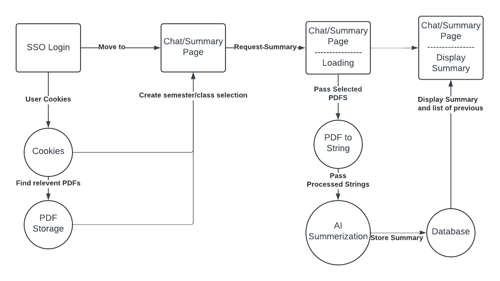

# Low-Level Design Document Outline

## 1. Introduction
- Brief overview of the project.
- Purpose of the low-level design document.

## 2. Module Breakdown

### 2.1. User Interface (UI/UX)
#### 2.1.1. Description
- Define how the user interface will provide intuitive interactions for professors with minimal technical expertise.
  
#### 2.1.2. Key Considerations
1. **Performance:**
   - Ensure lightweight, responsive design.
   - Use efficient rendering frameworks (e.g., React, Angular) to minimize load times and improve speed.
  
2. **Maintainability:**
   - Modular design for UI components, allowing for easy updates without disrupting other parts.
   - Use component-based architecture (e.g., reusable widgets) to simplify future updates.
  
3. **Integration:**
   - Ensure smooth integration with the authentication system (SSO).
   - Embed report generation and data display seamlessly within the UI to avoid manual processes.

4. **Complexity:**
   - Limit unnecessary complexity; keep the UI straightforward.
   - Implement navigation menus, buttons, and filters that allow professors to easily find and analyze feedback.
  
5. **Object-Oriented Design:**
   - Break the UI down into objects like `LoginPage`, `Dashboard`, `ReportViewer`, and `SettingsPanel`.
   - Each object/class represents a part of the user flow, ensuring cohesion between visual elements.

---

### 2.2. Security
#### 2.2.1. Description
- Explain the security protocols implemented to protect user data and maintain access control.
  
#### 2.2.2. Key Considerations
1. **Performance:**
   - Use lightweight encryption algorithms and minimize security-related bottlenecks (e.g., secure token caching).
   - Optimize secure database queries to avoid performance hits when authenticating users.

2. **Maintainability:**
   - Ensure security measures, like token authentication and password policies, are modular and upgradable without needing extensive codebase rewrites.
   - Implement role-based access control to adjust permissions easily.

3. **Integration:**
   - Seamless integration with the university's Single Sign-On (SSO) system.
   - Link to data governance tools and alert systems for unauthorized access detection.

4. **Complexity:**
   - Simplify security checks by grouping similar functionality into distinct modules (e.g., an `AuthorizationModule` that handles all permission checks).
   - Keep security policies centralized to avoid redundant code and scattered logic.

5. **Object-Oriented Design:**
   - Encapsulate security-related functions in classes like `AuthManager`, `SessionHandler`, and `PermissionValidator`.
   - Abstract sensitive data handling into private methods to enforce encapsulation.

---

### 2.3. Database Normalization
#### 2.3.1. Description
- Detail how the database schema is designed to ensure data consistency, avoid redundancy, and maintain integrity.

#### 2.3.2. Key Considerations
1. **Performance:**
   - Use optimized database queries and indexes to speed up lookups.
   - Ensure that normalized data structures (e.g., relational models) do not result in slow join operations by designing efficient keys.

2. **Maintainability:**
   - Design the database schema with third normal form (3NF) to reduce redundancy.
   - Simplify schema updates by using clear foreign key relationships and appropriate constraints.

3. **Integration:**
   - Ensure that the database integrates well with both the AI summarization engine and the user interface.
   - Link to external systems, such as the SSO service, for seamless data sharing and access logging.

4. **Complexity:**
   - Keep database design straightforward, focusing on clear relationships (e.g., between classes, professors, and reports).
   - Reduce unnecessary complexity by avoiding deep nesting and focusing on simple, readable tables.

5. **Object-Oriented Design:**
   - Use Object-Relational Mapping (ORM) tools (e.g., Hibernate) to model database tables as classes, making interaction with the database easier through object instances.
   - Define classes like `Professor`, `Report`, `Comment`, and `Department` that correspond to tables and relationships in the database.

---

## 3. Module Focus on Key Design Elements

### 3.1 PDF Parsing Module
- **Description**: This module will handle the extraction of text from uploaded PDF documents, converting them into strings that can be processed by other components of the system (e.g., for AI-based summarization).

#### 3.1.1. Key Considerations

1. **Performance:**
   - Use efficient libraries (e.g., `PyPDF2`, `PDFBox`, or `Tika`) to quickly extract text from PDFs.
   - Implement batch processing for multiple PDF uploads to avoid performance bottlenecks.
   - Cache extracted text for larger PDFs to reduce repeated parsing time.

2. **Maintainability:**
   - Design the PDF parsing functionality as a service that can be easily updated or replaced without disrupting other system modules.
   - Isolate parsing logic from other business logic to ensure updates in parsing libraries do not affect other components.

3. **Integration:**
   - Ensure seamless integration with the user-upload functionality and the AI Summarization Module.
   - Parsed text should be directly passed to the AI summarization system or stored in the database for future use.

4. **Complexity:**
   - Keep the PDF parsing logic simple by modularizing it—handle different types of PDF structures (e.g., text-heavy, image-heavy) in separate components.
   - Minimize the number of dependencies and library configurations needed to extract text.

5. **Object-Oriented Design:**
   - Create distinct classes like `PDFParser`, `DocumentProcessor`, and `TextExtractor` to encapsulate PDF parsing logic.
   - The `PDFParser` class should handle PDF file input and coordinate with `TextExtractor` to output strings.
   - Ensure that `DocumentProcessor` can extend functionality, allowing additional document types (e.g., Word, images with OCR) to be parsed in the future.
---

### 3.2 AI Summarization Module
- **Description**: This module will leverage artificial intelligence to generate comprehensive summaries from the extracted text of student feedback in IDEA survey reports. It will provide insights into general comments, strengths, and areas for improvement.

#### 3.2.1. Key Considerations

1. **Performance:**
   - Utilize efficient AI models (e.g., transformers or BERT-based models) that can process large text inputs quickly while maintaining accuracy.
   - Implement asynchronous processing for summary generation to avoid blocking user interactions and allow multiple requests to be handled simultaneously.
   - Cache frequently requested summaries to improve response time for commonly accessed reports.

2. **Maintainability:**
   - Abstract the AI model integration, allowing easy updates or replacements of the summarization algorithm without impacting the overall architecture.
   - Maintain clear documentation for the AI algorithms and their parameters to facilitate future enhancements or debugging.

3. **Integration:**
   - Ensure tight integration with the PDF Parsing Module, allowing parsed text to flow seamlessly into the summarization process.
   - Provide APIs for other system components to access the generated summaries, enabling functionalities such as report generation and data visualization.

4. **Complexity:**
   - Simplify the architecture by implementing a clear separation between the input processing, summarization logic, and output formatting.
   - Use design patterns (e.g., Strategy or Factory) to manage different summarization strategies based on user input or report types, reducing code complexity.

5. **Object-Oriented Design:**
   - Create distinct classes such as `SummaryGenerator`, `TextProcessor`, and `ModelSelector` to encapsulate different aspects of the summarization process.
   - The `SummaryGenerator` class should handle the core logic for generating summaries from text, while the `ModelSelector` determines the appropriate AI model to use based on input parameters.
   - Ensure that `TextProcessor` can handle various text preprocessing tasks (e.g., cleaning, tokenization) to prepare data for summarization.

---
### 3.3 API Module
- **Description**: This module will provide a set of RESTful APIs for communication between the front-end user interface, the backend processing modules, and the database. It will facilitate secure data exchange and ensure modularity within the system.

#### 3.3.1. Key Considerations

1. **Performance:**
   - Implement caching strategies (e.g., Redis or in-memory caching) for frequently accessed data to reduce response times and server load.
   - Use pagination for endpoints that return large datasets to improve response speed and user experience.
   - Optimize database queries and utilize indexing to enhance performance when retrieving data.

2. **Maintainability:**
   - Organize API endpoints logically, following RESTful principles to ensure clarity and ease of use. Use versioning (e.g., /api/v1) to facilitate future updates without breaking existing clients.
   - Document API endpoints thoroughly, including request/response formats and examples, to aid developers in understanding and using the API effectively.

3. **Integration:**
   - Ensure seamless integration with other modules (e.g., PDF Parsing, AI Summarization, and Database) by defining clear contracts for data exchange and ensuring consistent data formats.
   - Implement webhooks or event-driven architectures for real-time updates, allowing modules to react to data changes as they occur.

4. **Complexity:**
   - Minimize complexity by utilizing middleware for common tasks such as authentication, logging, and error handling. This allows the main application logic to remain focused on its core responsibilities.
   - Implement structured error handling across all endpoints, providing meaningful error messages and status codes to help clients diagnose issues quickly.

5. **Object-Oriented Design:**
   - Define an `ApiController` class to manage the routing and handling of incoming requests, with specialized controllers for different modules (e.g., `AuthController`, `ReportController`, `SummaryController`).
   - Utilize service classes (e.g., `ReportService`, `SummaryService`) to encapsulate business logic, keeping controllers lightweight and focused on request handling.
   - Implement data transfer objects (DTOs) to standardize the data structures used for API communication, ensuring consistency across requests and responses.

---

## 4. Conclusion
- Summary of how the design meets the project goals of UI/UX, Security, and Database Normalization.
- Emphasize how performance, maintainability, integration, complexity, and object-oriented principles are applied throughout the system.
