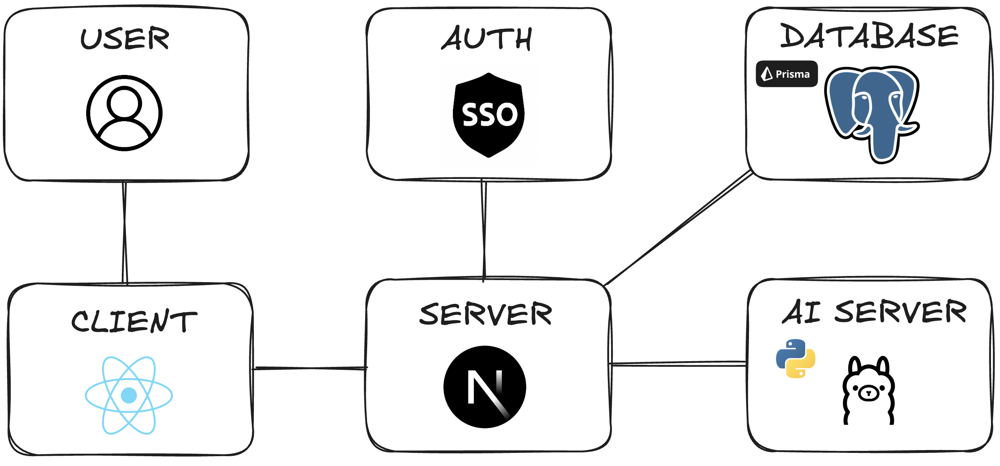

# Low-Level Design Document Outline

## Table of Contents
1. [Introduction](#1-introduction)
2. [Module Breakdown](#2-module-breakdown)
   - [2.1 User Interface (UI/UX)](#21-user-interface-uiux)
     - [2.1.1 Description](#211-description)
     - [2.1.2 Key Considerations](#212-key-considerations)
     - [2.1.3 Example Component](#213-example-component-for-reportviewer)
   - [2.2 Security](#22-security)
     - [2.2.1 Description](#221-description)
     - [2.2.2 Key Considerations](#222-key-considerations)
   - [2.3 Database Normalization](#23-database-normalization)
     - [2.3.1 Description](#231-description)
     - [2.3.2 Key Considerations](#232-key-considerations)
3. [Module Focus on Key Design Elements](#3-module-focus-on-key-design-elements)
   - [3.1 PDF Parsing Module](#31-pdf-parsing-module)
     - [3.1.1 Key Considerations](#311-key-considerations)
4. [API Design](#4-api-design)
   - [4.1 API Descriptions](#41-api-descriptions)
     - [4.1.1 Client-Server API](#411-client-server-api)
     - [4.1.2 Server-Database API](#412-server-database-api)
     - [4.1.3 Server-AI API](#413-server-ai-api)
       - [4.1.3.1 Semantic Analysis API](#4131-semantic-analysis-api)
       - [4.1.3.2 Report Summarization API](#4132-report-summarization-api)

## 1. Introduction
- Brief overview of the project.
- Purpose of the low-level design document.

<!--  -->

## 2. Module Breakdown

### 2.1. User Interface (UI/UX)
#### 2.1.1. Description
The user interface (UI) should provide an intuitive, user-friendly, experience for professors and department heads. We must keep in mind that user is computer literate, so making everything intuitive/familiar is key in our development. We want to make it easy to view reports, generate summaries, talk to the AI, and analyze data without complex workflows.

#### 2.1.2. Key Considerations
1. **Performance:**
   - We are going to be using Next.js's static generation and server-side(SSR) capabilities to improve performance by loading pages faster and reducing load times.
   - Leverage TypeScript for ensuring performance optimizations via stricter type-checking and minimizing runtime errors
   - Optimize the components using React's Virtual Document Object Model (VDOM) for efficient rendering

2. **Maintainability:**
   - Design the UI with **modular components**:
      - Button, InputField, Card, and ReportCard to minimize redundant code.
      - Organize componnents into separate folders based on their role (e.g. `/components`, `/pages`, `/layout`)
   - Use CSS modules to scope CSS styles to individual components, making them easy to refactor and maintain in the future.
   - Use USU's design standards to keep in line with what USU will want, defined [here](https://www.usu.edu/brand/standards/web/web-logos).
      - We will be using this color palette provided, mainly these colors: `#0F2439`, `##FFFFFF`, `#384660`, `#CED4DA`. If more colors are needed we will refer to USU Brand Standards.
      - When it comes to font we will use System UI fonts as described in the USU brand standards. Then a basic web fallback of: `Helvetica Neue, Arial, and sans-serif`.
      - Text Font size will be `16px`, and will use appropriate heading sizes when it's relevent.
   - Leverage TypeScript interfaces and types to ensure consistent propps across components, making them easy to refactor and maintain in the future.
   - Write unit tests for key components using **Jest** and **React Testing Library** to ensure they function correctly.
   - Ensure testing for different states (loading, success, error) for components that depend on asynchronous data fetching.


3. **Integration:**
   - **SSO Integration**: integrate with the Utah State University SSO system via the Next.js API routes for secure login (NOTE: we may need to switch to native login if we can't use SSO). Utilize Next.js built-in API routes for handling the authentication flow. 
   - Embed utilization features like **report generation** and **text chat** directly with the UI. Components like `ReportViewer` should dynamically fetch data using React Hooks (`useEffect`. `useState`) and display it efficiently.
   - Use `Next.js dynamic routing` to enable professors to navigate easily between pages like dashboards, reports, and settings.

4. **Complexity:**
   - Focus on creating a clean and simple design, sticking to USU's brand standards. While still creating new elements for loading screens and potential visual data.
   - Implement intuitive navigation:
      - a `navbar` for easy access to key sections like reports, messages, and settings.
      - Filters on report pages for professors to easily filter by class, date, and type. 
      - a chat text box that is intuitive that the user can interact with.
   -  Design components like `DropdownMenu`, `SearchBox`, and `Button` to simplify interactions.
   - Keep user interactions straightforward by offering well-labeled buttons like `Talk to ChatBot`, `Generate Report`, and `Export PDF` to reduce confusion.
   - Avoid unnecessary text to overwhelm the user. Keeping it clean as to naturally direct the user to the tools.

5. **Object-Oriented Design:**
   - Break down the interface into individual **UI components** that correspond to different sections of the app. Use **Next.js** pages to handle routing and React components for reusability.
   - Component Scructure:
      - **LoginPage**: Handles authentication and login logic using the SSO system.
      - **Dashboard**: Displays an overview of reports, summaries, and quick access to actions.
      - **ReportViewer**: A detailed view for reports, including filters and summaries.
      - **ChatBot**: A text box used to send data to our API for AI processing.
      - **SettingsPanel**: Provides the ability for professors to adjust preferences, filters, and notification settings.
      - **NavBar and Sidebar**: Persistent navigation components to provide easy access across the UI.

6. **Accessibility**:
   - Ensure the UI is accessible by adhering to WCAG 2.1 standards.
   - Use semantic HTML elements (e.g., `<header>` `<main>` `<footer>`) and aria-labels for screen readers.
   - Ensure components like `Button`, `DropdownMenu`, and `NavBar` are navigable using a keyboard and visually distinguishable with proper focus states.

7. **Responsive Design**:
   - Ensure that the UI is responsive and adapts to different screen sizes (e.g., desktop, tablet, mobile).
   - Use **CSS media queries** and **responsive layouts** to create a consistent experience across devices.

8. **Testing**
      - Write unit tests for key components using **Personal Tests** and **React Testing Library** to ensure they function correctly.
      - Ensure testing covers different states (e.g., loading, success, error) for components that depend on asynchronous data fetching.
      - Use snapshot testing for UI consistency and regression testing.

9. **Error Considerations**
    - **Error Handling:**
      - Use **React Error Boundaries** to catch JavaScript errors in the component tree and display a fallback UI instead of crashing.
      - Implement **try-catch blocks** for API calls using `fetch` to handle network errors.
      - Provide meaningful, user-friendly error messages for form validation and server-side errors.
    - **Error Feedback to Users:**
      - Show error messages or modals when issues arise, such as failed API calls or form validation errors (e.g., “Invalid credentials”).
      - Display loading spinners or skeleton loaders when fetching data, and use toast notifications to communicate success or failure for user actions.
      - Create custom error pages for **404 (Not Found)** and **500 (Internal Server Error)** using Next.js's error page functionality.

---
#### 2.1.3. Example Component for ReportViewer
- NOTE: subject to change due to different requirements. Not stuck to this.
```typescript
import React, { useState, useEffect } from 'react';

interface Report {
  id: string;
  title: string;
  date: string;
  summary: string;
}

const ReportViewer: React.FC = () => {
  const [reports, setReports] = useState<Report[]>([]);
  const [loading, setLoading] = useState<boolean>(true);

  // Fetch reports using Next.js API routes
  useEffect(() => {
    const fetchReports = async () => {
      setLoading(true);
      const response = await fetch('/api/reports');
      const data = await response.json();
      setReports(data);
      setLoading(false);
    };
    fetchReports();
  }, []);

  if (loading) return <div>Loading reports...</div>;

  return (
    <div className="report-list">
      {reports.map((report) => (
        <div key={report.id} className="report-card">
          <h3>{report.title}</h3>
          <p>{report.date}</p>
          <p>{report.summary}</p>
        </div>
      ))}
    </div>
  );
};

export default ReportViewer;

```
---

### 2.2. Security
#### 2.2.1. Description
- Given the various regulatory requirements that any final product would be expected to meet, security is a large task for this project. By utilizing single sign-on (SSO) capability through USU's Azure instance, we can ensure that university data is only shared with users affiliated with USU that are allowed to see protected data. We will also ensure that input data is correct and non-harmful to system security.

#### 2.2.2. Key Considerations
1. **Single Sign-On Integration:**
   - The system will integrate with the university's Single Sign-On (SSO) system, which uses Microsoft Azure, to provide seamless authentication for users. This will allow them to log in once with their A-Number and password to access resources. The SSO system will handle authentication, while the service itself will manage authorization. Additionally, user attributes can be passed to the service, and authentication will use the SAML protocol.
   - Access to the USU SSO Service can be requested on [ServiceNow](https://usu.service-now.com/aggies?id=sc_cat_item&sys_id=4dd14c19b0988200b5864eba133a1e81)
   - Example SAML response: 
      ```xml
      <saml:Assertion xmlns:saml="urn:oasis:names:tc:SAML:2.0:assertion">
         <saml:Subject>
            <saml:NameID>anumber@usu.edu</saml:NameID>
         </saml:Subject>
         <saml:AttributeStatement>
            <saml:Attribute Name="cn">
                  <saml:AttributeValue>Anumber</saml:AttributeValue>
            </saml:Attribute>
            <saml:Attribute Name="sAMAccountName">
                  <saml:AttributeValue>Anumber</saml:AttributeValue>
            </saml:Attribute>
            <saml:Attribute Name="givenName">
                  <saml:AttributeValue>First Name</saml:AttributeValue>
            </saml:Attribute>
            <saml:Attribute Name="sn">
                  <saml:AttributeValue>Last Name</saml:AttributeValue>
            </saml:Attribute>
            <saml:Attribute Name="displayName">
                  <saml:AttributeValue>First Name Last Name</saml:AttributeValue>
            </saml:Attribute>
            <saml:Attribute Name="eduPersonNickname">
                  <saml:AttributeValue>Preferred First Name</saml:AttributeValue>
            </saml:Attribute>
            <saml:Attribute Name="usuPreferredEmail">
                  <saml:AttributeValue>preferred.email@usu.edu</saml:AttributeValue>
            </saml:Attribute>
            <saml:Attribute Name="usuEmailIDAddress">
                  <saml:AttributeValue>emailid@usu.edu</saml:AttributeValue>
            </saml:Attribute>
            <saml:Attribute Name="mail">
                  <saml:AttributeValue>mail@usu.edu</saml:AttributeValue>
            </saml:Attribute>
            <saml:Attribute Name="memberOf">
                  <saml:AttributeValue>group1</saml:AttributeValue>
                  <saml:AttributeValue>group2</saml:AttributeValue>
            </saml:Attribute>
         </saml:AttributeStatement>
      </saml:Assertion>
      ```

2. **Front-End Data Checking:**
   - To ensure the security of the system, data checking and verification on the front-end will be utilized to ensure that good data is being passed to the back-end and prevent bad input from being given.
   - Example Pseudocode:
   ``` javascript
      async function validateInput() {
         await the results from user inputs
         validate the results
            - if good, set the data to the on screen refs and rerender
            - if bad, put up error on screen for user
      }
   ```

3. **AI Hardening**
   - As we are using AI systems for this project, ensuring they are robust against malicious or bad prompts is critical for maintaining security, privacy, and safety. Here are some ways to harden our AI against misuse:
      - Input Validation and Sanitization
         - AI systems must have mechanisms to validate and sanitize inputs before processing them. This can involve filtering out harmful, inappropriate, or anomalous inputs that may lead to misuse (e.g., injection attacks, attempts to access confidential information).
         - Using predefined rules, filters, or regular expressions, systems can ensure prompts adhere to expected formats and exclude prohibited language.
      - Prompt Moderation and Filtering
         - Develop and implement content moderation policies that scan inputs for sensitive or harmful content (e.g., hate speech, phishing attempts, harmful commands). Leveraging third-party APIs or in-house moderation tools to automatically detect and flag questionable inputs can help.
         - Additionally, integrating ethical guidelines or filters in the model can reduce the chance of generating responses that exacerbate bad prompts.
      - Rate Limiting and Throttling
         - Prevent AI abuse by implementing rate limiting for user inputs. By limiting the number of prompts a user can send within a certain timeframe, it reduces the risk of spamming, prompt injection, or overwhelming the system with malicious content.

4. **Database Security**
   - Access to the database will be controlled on the server-side to only allow authenticated requests to go through. All access should be limited based on the principle of least-priviledge.

5. **Data Goverance**
   - To meet any and all regulations around data access and release such as FERPA, the system must meet and exceed guildlines set out in [USU's data classification guide](https://usu.service-now.com/aggies?id=kb_article_view&sysparm_article=KB0015598)
   - Any personally-indentifiable information will be filtered out from ingested IDEA survey information and final reports and discarded. This includes names, A-Numbers, and more.
---

### 2.3. Database Normalization
#### 2.3.1. Description
The database schema is designed to ensure consistency, avoid redundancy, and maintain data integrity by adhering to third normal form (3NF). We are using **Prisma** as the Object-Relational Mapping (ORM) tool to manage the database interactions efficiently.

### 2.3. Database Design for Tracking User Activity and Request History
#### 2.3.1. Description
The database schema is designed to track user activities and maintain a history of their requests, including key entities like users, requests, AI-generated summaries, and logs of user actions. The schema is implemented using **Prisma ORM**, ensuring the structure is easy to maintain, consistent, and efficient in terms of query performance and data relationships.

The design adheres to third normal form (3NF) to minimize redundancy and ensure data integrity across the system, which handles user interactions, request processing, and summary generation.

#### 2.3.2. Key Considerations
1. **Performance:**
   - **Indexed Queries**: Prisma allows the creation of indexed fields to optimize query performance. For example, indexing on the `userId` field in the `Request` and `ActivityLog` tables ensures quick lookups when fetching all requests or logs related to a user:
     ```prisma
     model Request {
       id        Int      @id @default(autoincrement())
       userId    Int      @index
       requestType  Enum
       status    Enum
       requestData JSON
       createdAt DateTime @default(now())
     }
     ```
   - **Efficient Querying**: Prisma's lazy loading and `include` options allow fetching related data (like a user’s requests and associated summaries) in a single query to avoid N+1 problems:
     ```javascript
     const userRequests = await prisma.user.findUnique({
       where: { id: 1 },
       include: { requests: true },
     });
     ```

2. **Maintainability:**
   - **Schema Evolution**: Prisma’s migration system ensures that changes to the schema can be smoothly introduced. For example, adding a new field like `responseTime` to the `Request` table will automatically generate a migration:
     ```bash
     npx prisma migrate dev --name add_response_time_to_request
     ```
   - **Schema Modularity**: Each entity (User, Request, Summary, ActivityLog) is modularly designed, making updates easier without disrupting other parts of the system. New fields or entities can be added without affecting the overall data flow.

3. **Integration:**
   - **AI Summarization and Requests**: Prisma will store the results of AI-driven requests (e.g., summaries) and maintain links between user requests and the AI outputs. For example, after a summary is generated, it will be associated with the request and stored:
     ```javascript
     const newSummary = await prisma.summary.create({
       data: {
         requestId: requestId,
         summaryText: generatedSummary,
         sentimentScore: 0.75,
       },
     });
     ```
   - **User Activity Logging**: Prisma will track user actions (e.g., logging in, submitting requests) through the `ActivityLog` table. This allows detailed tracking of user behavior, improving auditing and debugging.

4. **Complexity:**
   - **Relational Simplicity**: The schema avoids unnecessary complexity by focusing on clear, direct relationships between key entities. For instance, a `User` can have many `Requests`, and each `Request` may have one associated `Summary`. This straightforward relational mapping reduces the complexity of joins and simplifies queries.
   - **Many-to-One and One-to-Many Relationships**: The relationships between `User`, `Request`, `Summary`, and `ActivityLog` are kept simple to maintain data clarity. For example:
     ```prisma
     model User {
       id       Int      @id @default(autoincrement())
       email    String   @unique
       requests Request[]
     }
     
     model Request {
       id       Int      @id @default(autoincrement())
       userId   Int
       summary  Summary?
     }
     ```

5. **Object-Oriented Design:**
   - **ORM-Driven Models**: Prisma automatically generates strongly-typed models based on the database schema. Each entity (e.g., `User`, `Request`, `Summary`) is mapped to a class-like structure in the application code, allowing object-oriented interaction with the database:
     ```typescript
     const user = await prisma.user.findUnique({
       where: { id: userId },
     });
     ```
   - **Encapsulation**: Each entity's behavior is encapsulated within the ORM models, allowing high-level interactions like creating, updating, or querying records without needing to write raw SQL. Transactions between related entities (e.g., `User` creating a `Request` and generating a `Summary`) are managed in a clear, object-oriented way:
     ```typescript
     await prisma.$transaction(async (prisma) => {
       const request = await prisma.request.create({...});
       const summary = await prisma.summary.create({...});
     });
     ```

By leveraging Prisma’s powerful ORM features, this schema is optimized for performance, maintainability, and integration, allowing for efficient tracking of user activity and the history of their requests. The use of object-oriented design principles and clean, modular relationships ensures that the system remains flexible and scalable as requirements evolve.


---

## 3. Module Focus on Key Design Elements

### 3.1 PDF Parsing Module
- **Description**: This module will handle the extraction of text from uploaded PDF documents, converting them into strings that can be processed by other components of the system (e.g., for AI-based summarization).

#### 3.1.1. Key Considerations

1. **Performance:**
   - Use efficient libraries (e.g., `PyPDF2`, `PDFBox`, or `Tika`) to quickly extract text from PDFs.
   - Implement batch processing for multiple PDF uploads to avoid performance bottlenecks.
   - Cache extracted text for larger PDFs to reduce repeated parsing time.

2. **Maintainability:**
   - Design the PDF parsing functionality as a service that can be easily updated or replaced without disrupting other system modules.
   - Isolate parsing logic from other business logic to ensure updates in parsing libraries do not affect other components.

3. **Integration:**
   - Ensure seamless integration with the user-upload functionality and the AI Summarization Module.
   - Parsed text should be directly passed to the AI summarization system or stored in the database for future use.

4. **Complexity:**
   - Keep the PDF parsing logic simple by modularizing it—handle different types of PDF structures (e.g., text-heavy, image-heavy) in separate components.
   - Minimize the number of dependencies and library configurations needed to extract text.

5. **Object-Oriented Design:**
   - Create distinct classes like `PDFParser`, `DocumentProcessor`, and `TextExtractor` to encapsulate PDF parsing logic.
   - The `PDFParser` class should handle PDF file input and coordinate with `TextExtractor` to output strings.
   - Ensure that `DocumentProcessor` can extend functionality, allowing additional document types (e.g., Word, images with OCR) to be parsed in the future.
---

# 4 API Design

Below this is portrayed a representation of the different components of the system and their relations to each other. Some sort of API exists where lines are drawn between system modules (not including the relationship between the user and the client). This means that there will essentially be 3 APIs:
- Client-Server API
- Server-Database API
- Server-AI API

Each of the following APIs will be described in detail in the following sections.



## 4.1 API Descriptions

### 4.1.1 Client-Server API
- **Description**: This API will handle the communication between the client-side UI and the server-side application, allowing professors to interact with the system and view feedback reports. Luckily for us, since we are using Next.JS, we can take advantage of the built in structure provided to us to fulfill the requirements of this API. Our client will use React, but with Next.JS, this entire layer will be abstracted away from us using the magic of server side rendering.

### 4.1.2 Server-Database API
- **Description**: This API will manage the interaction between the server application and the database, handling data retrieval, storage, and updates. This API will be also be primarily abstracted away from us by using Next.JS and Prisma. Prisma is an ORM that will handle all of the database interactions for us. A reference from a server-side function to a Prisma query will look like this:

```javascript
export async function getStaticProps() {
  const prisma = new PrismaClient()
  const report = await prisma.reports.findFirst(
    where: {
      professor: {
        id: 1
      },
      course:
      {
        id: 1
      },
      semester:
      {
        id: 1
      }
    }
  )

  return {
    props : { posts }
  }
}
```

This will return the report for the professor with the id of 1, the course with the id of 1, and the semester with the id of 1. This is a very simple example, but it shows how easy it is to interact with the database using Prisma inside of a component.

### 4.1.3 Server-AI API

- **Description**: This API will facilitate communication between the server application and the AI Summarization Module, allowing for the summarization of feedback reports. This API will be the most complex because there needs to be some communication layer between the server and a Python handled AI server.

#### 4.1.3.1 Semantic Analysis API

- **URL**: `/api/semantic`
- **Method**: `POST`
- **Description**: This endpoint will be used to perform semantic analysis on the uploaded IDEA reports using an AI engine. The endpoint will optionally take the class names, start date, and end date as input parameters to filter the reports. The AI engine will analyze the qualitative comments and generate sentiment and attitude scores for each comment. For example, a piece of this data may look like `{"attribute": "exlanatory", "sentiment": 1}`. This would mean that the professor is doing well in explaining the material. As another example, `{"attribute": "grading", "sentiment": -1}` would mean that the students are not happy with the grading.
- **Request Body**:
```json
{
  "classIds": ["CS101", "CS102"],
  "startDate": "2022-01-01",
  "endDate": "2022-12-31"
}
```
- **Response**:
```json
{
  "data": [
    {
      "attribute": "An attribute of the professor's performance",
      "sentiment": "An value 1, 0, or -1 indicating a positive, neutral, or negative sentiment",
    },
    ...
  ]
}
```

#### 4.1.3.2 Report Summarization API

The chat endpoints will be used to facilitate communication between professors and the AI engine. Professors can ask questions, provide feedback, or request additional information using the chat feature. Chats will always begin with a system message requesting the initial report summary. The AI engine will then respond with the summary. Following messages will be provided by the professor and responded to by the AI engine.

##### GET a chat
- **URL**: `/api/chat/<id>`
- **Method**: `GET`
- **Description**: Retrieves the chat history for the given chat id as a json object.
- **Response**:
```json
{
  "id": "The unique identifier for the chat",
  "messages": [
    {
      "sender": "The sender of the message (this will either be a user, ai, or system)",
      "content": "The content of the message",
      "timestamp": "The timestamp of the message"
    },
    ...
  ]
}
```

##### POST a chat
- **URL**: `/api/chat`
- **Method**: `POST`
- **Description**: Creates a new chat starting with a message from the system followed by a message from the ai engine with the report summary.
- **Request Body**:
```json
{
  "classIds": ["CS101", "CS102"],
  "startDate": "2022-01-01",
  "endDate": "2022-12-31"
}
```
- **Response**:
```json
{
  "id": "The unique identifier for the chat",
  "messages": [
    {
      "sender": "system",
      "content": "A message to the AI detailing what the user would like to have in the report. This will include requests for the big three questions, \"What is a general summary of the feedback?\", \"What did I do well?\", and \"What can I improve?\". An exact example of this message is not provided as we will be finding a good message to send to the AI during the prototype phase which is not yet determined.",
      "timestamp": "The timestamp of the message in ISO 8601 format (ex. 2024-09-27T14:41:52Z)"
    },
    {
      "sender": "ai",
      "content": "The response from the AI engine with the report summary.",
      "timestamp": "The timestamp of the message in ISO 8601 format (ex. 2024-09-27T14:41:52Z)"
    },
  ]
}
```

##### POST a message
- **URL**: `/api/chat/<id>/message`
- **Method**: `POST`
- **Description**: Sends in a new message from the user to the AI engine and returns the response from the AI engine. When the user sends the json object which only takes in the content field, the server will automatically add the "sender" field and the "timestamp" field to the object before saving it to the database.
- **Request Body**:
```json
{
  "content": "The content of the message from the user",
}
```
- **Response**:
```json
{
    "sender": "ai"
    "content": "The content of the message",
    "timestamp": "The timestamp of the message in ISO 8601 format (ex. 2024-09-27T14:41:52Z)"
}
```

##### GET download summary
- **URL**: `/api/chat/<id>/download/<format>`
- **Method**: `GET`
- **Description**: Downloads the chat history for the given chat id as a file in the specified format (e.g., PDF **(M)**, CSV **(S)**, etc. **(S)**).
- **Response**: The file in the specified format.

## 4.2 Error Handling

### 4.2.1 Error Codes
The following error codes may be returned by the API:
- `400 Bad Request`: Invalid input parameters.
- `401 Unauthorized`: User is not authenticated.
- `403 Forbidden`: User does not have permission to access the resource.
- `404 Not Found`: Resource not found.
- `500 Internal Server Error`: Unexpected server error.

### 4.2.2 Priority of Error Handling
- **Authorization Errors**: Unauthorized errors should be handled first to ensure data security. This means that the an unauthenticated user can not determine what resource exists on a server or not by probing for 403 and 404 errors.

- **Validation Errors**: Bad request errors should be handled next to ensure that the user is aware of the invalid input parameters.

- **Permission Errors**: Forbidden errors should be handled next. This ensures that an authenticated user cannot probe around the server to find existing resources that they do not have access to.

- **Not Found Errors**: Not found errors should be handled next. This should only be returned if an authenticated user is trying to access their own resources that do not exist.

- **Server Errors**: Internal server errors should be handled last as they are unexpected and should be logged for debugging purposes.

---

## 5. Conclusion
- Summary of how the design meets the project goals of UI/UX, Security, and Database Normalization.
- Emphasize how performance, maintainability, integration, complexity, and object-oriented principles are applied throughout the system.
