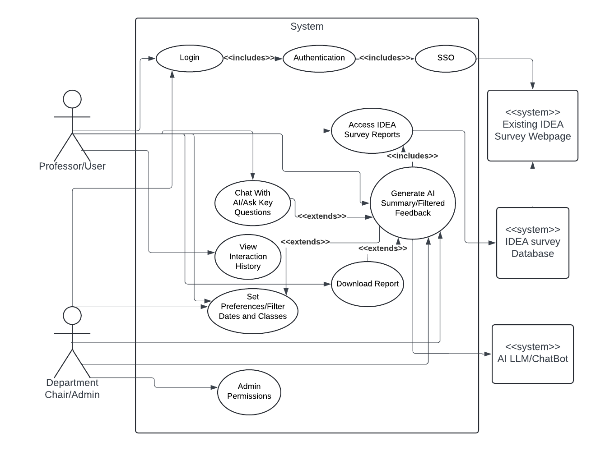

# Introduction

## Project Overview

The project aims to provide faculty at Utah State University (USU) with enhanced insights from their IDEA survey reports. IDEA surveys are conducted at the end of each semester, where students rate and comment on their courses and instructors. This project leverages artificial intelligence to summarize student comments over a selected timeframe and set of classes, delivering three key insights to professors:

1. An overview of the general comments.
2. Highlights of what was done well during the semester.
3. Recommendations for improvement.

The system will integrate seamlessly with existing USU systems, allowing professors to log in and generate AI-driven analyses of their IDEA survey reports. Additionally, professors will have the option to ask specific questions to the AI, such as "What do students think about the fairness of my quizzes?" or "How difficult is my class?" to gain deeper insights into student perceptions.

## Stakeholders

### Impacted Groups

1. **USU Office of Data & Analytics**: Sponsoring the tool’s development and responsible for business operations post-launch. Design decisions directly impact this office.
2. **USU Faculty**: Professors, instructors, and department heads will form the primary user base. Their workflow will be directly influenced by this tool.
3. **University Administration**: Reports generated by the tool will likely be reviewed by administrative offices. The tool will also help increase compliance with course evaluation policies.
4. **USU Student Body**: Though not direct users, students' feedback data will be processed by this system, indirectly impacting decisions that affect student life.

## Purpose of Requirements Document

This document outlines the specifications and expectations for developing the AI-driven analysis system for IDEA survey reports at USU. It serves as a comprehensive guide for developers, faculty members, and Erik Falor to ensure clear understanding of project objectives, functionalities, and constraints. By detailing functional, non-functional, technical, and user requirements, this document aims to provide a solid foundation for the successful implementation of the system.

# Requirements

## Functional Requirements

1. **Authentication and Access Control**
    - Professors shall log in using Utah State University's Single Sign-On (SSO) for secure authentication. **(M)**
        - As a professor, I want to securely log in using my USU SSO credentials to access my IDEA reports without needing another password.
    - Professors shall only access their own IDEA survey reports after logging in. **(M)**
        - As a professor, I want to ensure that only I can access my own IDEA reports after logging in.
    - Admins shall have permission-based access to professors' IDEA reports. **(S)**
        - As a department chair, I want to access the IDEA reports of the professors I oversee.

2. **AI-Powered Summarization**
    - The system shall generate AI-driven summaries of student feedback from external PDFs, focusing on qualitative comments. **(M)**
        - As a professor, I want comprehensive summaries of qualitative feedback from my IDEA survey reports.
    - The system shall answer specific key questions, such as:
        1. "What is the general overview of the comments?" **(M)**
        2. "What did I do well?" **(M)**
        3. "What can I do better?" **(M)**
        - As a professor, I want answers to these questions to quickly understand student feedback.
    - The system shall allow professors to input custom questions for the AI. **(C)**
        - As a professor, I want to ask custom questions and receive targeted insights from the AI.
    - The system shall store a history of AI-chat interactions for review. **(S)**
        - As a professor, I want a record of my interactions with the AI for future reference.

3. **Filtering and Reporting**
    - Professors shall filter feedback by class and time period. **(M)**
        - As a professor, I want to filter feedback by specific classes and time frames.
    - The system shall support aggregation of multiple IDEA reports over different time periods to detect trends. **(M)**
        - As a professor, I want to aggregate reports over time to track trends in my teaching.
    - The system shall generate summary reports in PDF format. **(M)**
        - As a professor, I want to generate printable reports in PDF format.
    - Professors shall be able to download reports in various formats (PDF, CSV, DOCX). **(S)**
        - As a professor, I want reports in multiple formats for different use cases.
    - Reports shall include citations of specific comments used by the AI for transparency. **(S)**
        - As a professor, I want specific comments cited for better understanding of the summary.

4. **Content Moderation and Filtering**
    - The system shall filter out inappropriate or aggressive comments to protect professors. **(M)**
        - As a professor, I want aggressive comments filtered out to reduce emotional stress.
    - Professors shall be able to toggle the moderation filter on or off. **(C)**
        - As a professor, I want to control whether filtered or all comments are visible.

5. **Report Generation and Downloading**
    - The system shall include the initial prompt used to generate each report for transparency. **(M)**
        - As a professor, I want to know the prompt used for report generation to understand the context.

## Non-Functional Requirements

1. **User-Friendly and Accessible**
    - The system shall provide an intuitive UI for professors to access and download reports without technical expertise. **(M)**
        - As a non-tech-savvy professor, I want a simple and intuitive interface.
    - Error messages shall be useful and guide professors to available support resources. **(S)**
        - As a professor, I want clear and helpful error messages.
    - The system shall be accessible via all major web browsers and mobile devices. **(S)**
        - As a professor, I want mobile and browser support for convenient access.
    - The system shall comply with USU accessibility standards. **(S)**
        - As a professor, I want the system to be compliant with accessibility standards.

2. **Data Privacy and Data Governance Compliance**
    - The system shall comply with FERPA and other relevant data privacy regulations. **(M)**

3. **System Security**
    - The system shall implement security measures to protect user data and prevent unauthorized access. **(M)**
        - As a professor, I want my feedback to be secure.

4. **System Performance**
    - The system shall provide a smooth, responsive experience. **(S)**
        - As a professor, I want the system to be fast and reliable.

## Business Requirements

1. **Analytics**
    - The system shall track user engagement (e.g., which professors log in and how often). **(C)**
        - As a department chair, I want to monitor engagement with the system.

2. **Security**
    - Professors shall only have access to their own IDEA reports. **(M)**
        - As a professor, I want my access limited to my own reports.

3. **Platform**
    - The system shall be accessible as a mobile app. **(C)**
        - As a professor, I want mobile access for on-the-go use.
    - The system shall integrate seamlessly with existing USU websites. **(C)**
        - As an admin, I want seamless integration with USU platforms.
    - The system shall follow USU brand guidelines. **(S)**
        - As a professor, I want the system to match USU’s branding.

4. **Admin**
    - Admin users shall have visibility into the IDEA reports of users they manage. **(C)**
        - As a department chair, I want to oversee the IDEA reports of the professors I manage.

## User Requirements

1. **Access to IDEA Reports**
    - Professors shall log in using their USU SSO credentials. **(M)**
        - As a professor, I want to securely log in using my USU SSO credintials, ensuring only I have access to my own IDEA reports.
    - Admins shall have permission-based access to the IDEA reports of professors they oversee. **(S)**
      - As a department chair or admin, I want permission-based access to the IDEA reports of the professors I oversee, so I can provide guidance and support.

2. **AI-Driven Feedback Summarization**
    - Professors shall generate AI-driven summaries of student feedback. **(M)**
        - As a professor, I want to generate AI-driven summaries of student feedback, focusing on general overviews, positive aspects, and areas for improvement, so I can quickly assess my teaching performance.
    - Professors shall input custom questions to gain specific insights. **(C)**
        - As a professor, I want the AI to answer specific questions like "How fair are my quizzes?" or "What do students think about the difficulty of my class?" to gain deeper insights from the data.

3. **Comment Filtering and Data Customization**
    - Professors shall filter feedback by class and timeframe. **(M)**
        - As a professor, I want to filter feedback by specific classes and timeframes so that I can perform a targeted analysis.
    - Professors shall aggregate multiple reports to track trends. **(M)**
        - As a professor, I want to aggregate feedback from multiple reports to identify trends over time and track changes in my teaching effectiveness.

4. **Data Reports**
    - Professors shall download feedback reports in multiple formats (PDF, CSV, DOCX). **(S)**
        - As a professor, I want to download my summarized feedback reports in multiple formats, such as PDF, CSV, and DOCX, for easy sharing and record-keeping.

5. **User Interface and Ease of Use**
    - Professors shall have access to an intuitive and user-friendly system. **(M)**
        - As a professor who is maybe not tech-savvy, I want a user-friendly and intuitive system that I can navigate without difficulty.
    - Mobile support shall be available for accessing reports on the go. **(C)**
        - As a professor, I want mobile support (Where reasonable to implement) for accessing feedback on-the-go, so I can review insights from anywhere.

6. **Interaction and Feedback Transparency**
    - Reports shall include the initial prompt for transparency. **(M)**
        - As a professor, I want the prompt used to generate the report included for transparency, so I understand the context of the analysis.

7. **Security and Data Privacy**
    - The system shall comply with USU’s data privacy policies and FERPA. **(M)**
        - As a professor, I want the system to comply with university data privacy policies and FERPA regulations, so I can trust that my feedback is handled responsibly and securely.

# Won't Do

- Students and the general public will not have access to the reports.
- Quantitative reporting or analysis features will not be included.
- Prompt engineering concerns from professors will not be addressed.

# Use Case Diagram

