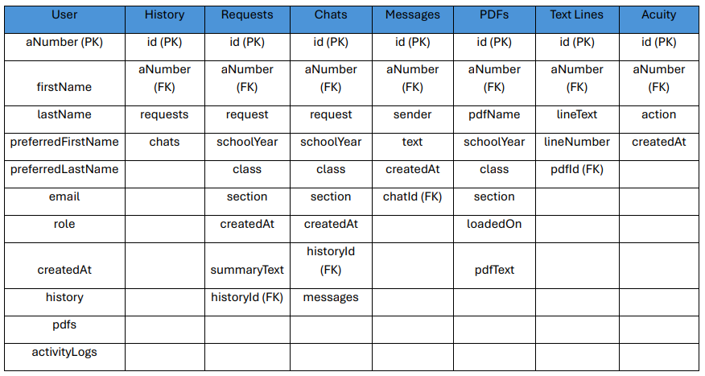

# Low-Level Design Document Outline

## Table of Contents
1. [Introduction](#1-introduction)
2. [Module Breakdown](#2-module-breakdown)
   - [2.1 User Interface (UI/UX)](#21-user-interface-uiux)
     - [2.1.1 Description](#211-description)
     - [2.1.2 Key Considerations](#212-key-considerations)
     - [2.1.3 Example Component](#213-example-component-for-reportviewer)
   - [2.2 Security](#22-security)
     - [2.2.1 Description](#221-description)
     - [2.2.2 Key Considerations](#222-key-considerations)
   - [2.3 Database Normalization](#23-database-normalization)
     - [2.3.1 Description](#231-description)
     - [2.3.2 Key Considerations](#232-key-considerations)
3. [Module Focus on Key Design Elements](#3-module-focus-on-key-design-elements)
   - [3.1 PDF Parsing Module](#31-pdf-parsing-module)
     - [3.1.1 Key Considerations](#311-key-considerations)
4. [API Design](#4-api-design)
   - [4.1 API Descriptions](#41-api-descriptions)
     - [4.1.1 Client-Server API](#411-client-server-api)
     - [4.1.2 Server-Database API](#412-server-database-api)
     - [4.1.3 Server-AI API](#413-server-ai-api)
       - [4.1.3.1 Semantic Analysis API](#4131-semantic-analysis-api)
       - [4.1.3.2 Report Summarization API](#4132-report-summarization-api)
       - [4.1.3.3 Test Endpoints](#4133-test-endpoints)
## 1. Introduction
- This documents purpose is to break the design for our IDE-AI project down into even more manageble and detailed pieces.

Data flow Diagram


## 2. Module Breakdown

### 2.1. User Interface (UI/UX)
#### 2.1.1. Description

The user interface (UI) should provide an intuitive, user-friendly experience for professors and department heads. We must keep in mind that the user is computer literate, so making everything intuitive/familiar is key in our development. We want to make it easy to view reports, generate summaries, talk to the AI, and analyze data without complex workflows.

#### 2.1.2. Key Considerations
1. **Performance:**

   - We are going to be using Next.js's static generation and server-side rendering (SSR) capabilities to improve performance by loading pages faster and reducing load times.
   - Leverage TypeScript for ensuring performance optimizations via stricter type-checking and minimizing runtime errors.
   - Optimize the components using React's Virtual Document Object Model (VDOM) for efficient rendering.

2. **Maintainability:**
   - Design the UI with **modular components**:
     - Button, InputField, Card, and ReportCard to minimize redundant code.
     - Organize components into separate folders based on their role (e.g., `/components`, `/pages`, `/layout`).
   - Use CSS modules to scope CSS styles to individual components, making them easy to refactor and maintain in the future.
   - Use USU's design standards to keep in line with what USU will want, defined [here](https://www.usu.edu/brand/standards/web/web-logos).
     - We will be using this color palette provided, mainly these colors: `#0F2439`, `#FFFFFF`, `#384660`, `#CED4DA`. If more colors are needed, we will refer to USU Brand Standards.
     - When it comes to font, we will use System UI fonts as described in the USU brand standards, then a basic web fallback of: `Helvetica Neue, Arial, and sans-serif`.
     - Text font size will be `16px`, and we will use appropriate heading sizes when relevant.
   - Leverage TypeScript interfaces and types to ensure consistent props across components, making them easy to refactor and maintain in the future.
   - Write unit tests for key components using **Jest** and **React Testing Library** to ensure they function correctly.
   - Ensure testing for different states (loading, success, error) for components that depend on asynchronous data fetching.

3. **Integration:**

   - **SSO Integration**: Integrate with the Utah State University SSO system via the Next.js API routes for secure login (NOTE: we may need to switch to native login if we can't use SSO). Utilize Next.js built-in API routes for handling the authentication flow.
   - Embed utilization features like **report generation** and **text chat** directly within the UI. Components like `ReportViewer` should dynamically fetch data using React Hooks (`useEffect`, `useState`) and display it efficiently.
   - Use `Next.js dynamic routing` to enable professors to navigate easily between pages like dashboards, reports, and settings.

4. **Complexity:**

   - Focus on creating a clean and simple design, sticking to USU's brand standards while still creating new elements for loading screens and potential visual data.
   - Implement intuitive navigation:
     - A `navbar` for easy access to key sections like reports, messages, and settings.
     - Filters on report pages for professors to easily filter by class, date, and type.
     - A chat text box that is intuitive for user interaction.
   - Design components like `DropdownMenu`, `SearchBox`, and `Button` to simplify interactions.
   - Keep user interactions straightforward by offering well-labeled buttons like `Talk to ChatBot`, `Generate Report`, and `Export PDF` to reduce confusion.
   - Avoid unnecessary text to overwhelm the user, keeping it clean to naturally direct the user to the tools.

5. **Object-Oriented Design:**
   - Break down the interface into individual **UI components** that correspond to different sections of the app. Use **Next.js** pages to handle routing and React components for reusability.
   - Component Structure:
     - **LoginPage**: Handles authentication and login logic using the SSO system.
     - **Dashboard**: Displays an overview of reports, summaries, and quick access to actions.
     - **ReportViewer**: A detailed view for reports, including filters and summaries.
     - **ChatBot**: A text box used to send data to our API for AI processing.
     - **SettingsPanel**: Provides the ability for professors to adjust preferences, filters, and notification settings.
     - **NavBar and Sidebar**: Persistent navigation components to provide easy access across the UI.

6. **Accessibility**:
   - Ensure the UI is accessible by adhering to WCAG 2.1 standards.
   - Use semantic HTML elements (e.g., `<header>`, `<main>`, `<footer>`) and aria-labels for screen readers.
   - Ensure components like `Button`, `DropdownMenu`, and `NavBar` are navigable using a keyboard and visually distinguishable with proper focus states.

7. **Responsive Design**:
   - Ensure that the UI is responsive and adapts to different screen sizes (e.g., desktop, tablet, mobile).
   - Use **CSS media queries** and **responsive layouts** to create a consistent experience across devices.

8. **Testing**

   - Write unit tests for key components using **Jest** and **React Testing Library** to ensure they function correctly.
   - Ensure testing covers different states (e.g., loading, success, error) for components that depend on asynchronous data fetching.
   - Use snapshot testing for UI consistency and regression testing.

9. **Error Considerations**
   - **Error Handling:**
     - Use **React Error Boundaries** to catch JavaScript errors in the component tree and display a fallback UI instead of crashing.
     - Implement **try-catch blocks** for API calls using `fetch` to handle network errors.
     - Provide meaningful, user-friendly error messages for form validation and server-side errors.
   - **Error Feedback to Users:**
     - Show error messages or modals when issues arise, such as failed API calls or form validation errors (e.g., "Invalid credentials").
     - Display loading spinners or skeleton loaders when fetching data, and use toast notifications to communicate success or failure for user actions.
     - Create custom error pages for **404 (Not Found)** and **500 (Internal Server Error)** using Next.js's error page functionality.

---
#### 2.1.3. Example Component for ReportViewer

- NOTE: Subject to change due to different requirements. Not stuck to this.

```typescript
import React, { useState, useEffect } from 'react';

interface Report {
  id: string;
  title: string;
  date: string;
  summary: string;
}

const ReportViewer: React.FC = () => {
  const [reports, setReports] = useState<Report[]>([]);
  const [loading, setLoading] = useState<boolean>(true);

  // Fetch reports using Next.js API routes
  useEffect(() => {
    const fetchReports = async () => {
      setLoading(true);
      const response = await fetch('/api/reports');
      const data = await response.json();
      setReports(data);
      setLoading(false);
    };
    fetchReports();
  }, []);

  if (loading) return <div>Loading reports...</div>;

  return (
    <div className="report-list">
      {reports.map((report) => (
        <div key={report.id} className="report-card">
          <h3>{report.title}</h3>
          <p>{report.date}</p>
          <p>{report.summary}</p>
        </div>
      ))}
    </div>
  );
};

export default ReportViewer;
```
---

### 2.2. Security
#### 2.2.1. Description
- Given the various regulatory requirements that any final product would be expected to meet, security is a large task for this project. By utilizing single sign-on (SSO) capability through USU's Azure instance, we can ensure that university data is only shared with users affiliated with USU that are allowed to see protected data. We will also ensure that input data is correct and non-harmful to system security.

#### 2.2.2. Key Considerations
1. **Single Sign-On Integration:**
   - The system will integrate with the university's Single Sign-On (SSO) system, which uses Microsoft Azure, to provide seamless authentication for users. This will allow them to log in once with their A-Number and password to access resources. The SSO system will handle authentication, while the service itself will manage authorization. Additionally, user attributes can be passed to the service, and authentication will use the SAML protocol.
   - Access to the USU SSO Service can be requested on [ServiceNow](https://usu.service-now.com/aggies?id=sc_cat_item\&sys_id=4dd14c19b0988200b5864eba133a1e81)
   - Example SAML response:
     ```xml
     <saml:Assertion xmlns:saml="urn:oasis:names:tc:SAML:2.0:assertion">
        <saml:Subject>
           <saml:NameID>anumber@usu.edu</saml:NameID>
        </saml:Subject>
        <saml:AttributeStatement>
           <saml:Attribute Name="cn">
                 <saml:AttributeValue>Anumber</saml:AttributeValue>
           </saml:Attribute>
           <saml:Attribute Name="sAMAccountName">
                 <saml:AttributeValue>Anumber</saml:AttributeValue>
           </saml:Attribute>
           <saml:Attribute Name="givenName">
                 <saml:AttributeValue>First Name</saml:AttributeValue>
           </saml:Attribute>
           <saml:Attribute Name="sn">
                 <saml:AttributeValue>Last Name</saml:AttributeValue>
           </saml:Attribute>
           <saml:Attribute Name="displayName">
                 <saml:AttributeValue>First Name Last Name</saml:AttributeValue>
           </saml:Attribute>
           <saml:Attribute Name="eduPersonNickname">
                 <saml:AttributeValue>Preferred First Name</saml:AttributeValue>
           </saml:Attribute>
           <saml:Attribute Name="usuPreferredEmail">
                 <saml:AttributeValue>preferred.email@usu.edu</saml:AttributeValue>
           </saml:Attribute>
           <saml:Attribute Name="usuEmailIDAddress">
                 <saml:AttributeValue>emailid@usu.edu</saml:AttributeValue>
           </saml:Attribute>
           <saml:Attribute Name="mail">
                 <saml:AttributeValue>mail@usu.edu</saml:AttributeValue>
           </saml:Attribute>
           <saml:Attribute Name="memberOf">
                 <saml:AttributeValue>group1</saml:AttributeValue>
                 <saml:AttributeValue>group2</saml:AttributeValue>
           </saml:Attribute>
        </saml:AttributeStatement>
     </saml:Assertion>
     ```

2. **Session Data**
  - User authorization will be performed through signed and encrypted cookies that can be decoded on server-side in a stateless fashion.
    - Cookies will be implemented using the `iron-session` JavaScript library
    - Server-side function for accessing session data:

    ```javascript
      "use server"
      import { cookies } from 'next/headers';
      import { getIronSession } from 'iron-session';

      import { type SessionData, sessionOptions } from "../app/api/lib";

      export async function getUserSession() {
          const session = await getIronSession<SessionData>(cookies(), sessionOptions);

          return session;
      }

      export interface SessionData {
          aNumber: string;
          name: string;
          preferredName: string;
          email: string;
          role: string[];
          isLoggedIn: boolean;
      };
    ```

    - Accessing from a route:

    ```javascript
      import { getUserSession } from '~/actions/session';

      async function example() {
        const user = getUserSession();
      }
    ```

2. **Front-End Data Checking:**
   - To ensure the security of the system, data checking and verification on the front-end will be utilized to ensure that good data is being passed to the back-end and prevent bad input from being given.
   - Example Pseudocode:

   ```javascript
      async function validateInput() {
         await the results from user inputs
         validate the results
            - if good, set the data to the on screen refs and rerender
            - if bad, put up error on screen for user
      }
   ```

3. **AI Hardening**
   - As we are using AI systems for this project, ensuring they are robust against malicious or bad prompts is critical for maintaining security, privacy, and safety. Here are some ways to harden our AI against misuse:
     - Input Validation and Sanitization
       - AI systems must have mechanisms to validate and sanitize inputs before processing them. This can involve filtering out harmful, inappropriate, or anomalous inputs that may lead to misuse (e.g., injection attacks, attempts to access confidential information).
       - Using predefined rules, filters, or regular expressions, systems can ensure prompts adhere to expected formats and exclude prohibited language.
     - Prompt Moderation and Filtering
       - Develop and implement content moderation policies that scan inputs for sensitive or harmful content (e.g., hate speech, phishing attempts, harmful commands). Leveraging third-party APIs or in-house moderation tools to automatically detect and flag questionable inputs can help.
       - Additionally, integrating ethical guidelines or filters in the model can reduce the chance of generating responses that exacerbate bad prompts.
     - Rate Limiting and Throttling
       - Prevent AI abuse by implementing rate limiting for user inputs. By limiting the number of prompts a user can send within a certain timeframe, it reduces the risk of spamming, prompt injection, or overwhelming the system with malicious content.

4. **Database Security**

   - Access to the database will be controlled on the server-side to only allow authenticated requests to go through. All access should be limited based on the principle of least privilege.

5. **Data Governance**

   - To meet any and all regulations around data access and release, such as FERPA, the system must meet and exceed guidelines set out in [USU's data classification guide](https://usu.service-now.com/aggies?id=kb_article_view\&sysparm_article=KB0015598).
   - Any personally identifiable information will be filtered out from ingested IDEA survey information and final reports and discarded. This includes names, A-Numbers, and more.

---

### 2.3. Database Schema and Normalization

#### 2.3.1. Description

The database schema is designed to ensure consistency, avoid redundancy, and maintain data integrity by adhering to the principles of third normal form (3NF). We utilize **Prisma** as the Object-Relational Mapping (ORM) tool to efficiently manage all database interactions, ensuring the data model is both flexible and performant.

#### 2.3.2. Key Considerations

1. **Performance:**
   - **Indexed Queries**: The schema employs indexed fields to optimize query performance. For example, the `aNumber` field in the `History`, `Requests`, `Chats`, and `ActivityLog` tables is indexed to ensure efficient lookups. These indexes help in speeding up operations like fetching a user’s history or associated activity logs.
     
     - In the `schema.prisma` file, indexes are explicitly defined using the `@@index` directive to facilitate faster searches:
       ```prisma
       model History {
         id       Int     @id @default(autoincrement())
         aNumber  String  @unique
         requests Requests[]
         chats    Chats[]
         user     User    @relation(fields: [aNumber], references: [aNumber])
         
         @@index([aNumber])
       }
       ```

   - **Efficient Querying**: Prisma's `include` feature allows related data to be retrieved efficiently in a single query, avoiding the N+1 problem. For example, retrieving a user along with their history and activity logs can be done as follows:
     ```typescript
     const userWithHistoryAndLogs = await db.user.findUnique({
       where: { aNumber: "A123" },
       include: { history: true, activityLogs: true }
     });
     ```

2. **Maintainability:**
   - **Schema Evolution**: Prisma’s migration system facilitates the easy evolution of the database schema. For instance, adding a new field such as `preferredName` to the `User` table can be done using Prisma migrations:
     ```bash
     bun prisma migrate dev --name add_preferred_name_to_user
     ```
     This generates a migration script that is then applied to the database to keep the schema up to date.
   
   - **Schema Modularity**: Each entity in the schema is designed to be modular, meaning that changes to individual entities (e.g., adding fields or updating relationships) can be made without affecting the entire schema. For example, adding a new relation to the `User` table will not disrupt existing relations between `User`, `Requests`, `Pdfs`, etc.

3. **Integration:**
   - **User and Request Management**: Prisma is used to create, update, and delete users, requests, and other related data, such as PDFs and messages. For example, when a user is created, a corresponding `History` record is also created:
     ```typescript
     const newUser = await db.user.create({
       data: { aNumber, name, preferredName, email, role },
     });
     
     const newHistory = await db.history.create({
       data: { aNumber },
     });
     ```

   - **User Activity Logging**: The `ActivityLog` table records user actions such as creating a request or submitting a message. This enables better auditing and debugging capabilities:
     ```typescript
     const newActivityLog = await db.activityLog.create({
       data: { aNumber, action: "User logged in" },
     });
     ```

4. **Complexity Management:**
   - **Relational Simplicity**: The schema maintains straightforward relationships between entities to avoid unnecessary complexity. For instance, each `User` has a one-to-one relationship with `History` and one-to-many relationships with `Requests`, `Chats`, and `Pdfs`. This helps minimize the complexity of joins and keeps the data model easy to understand and work with.
     
     - **One-to-One Relationship**: The `User` and `History` models maintain a one-to-one relationship to ensure that each user has a unique history:
       ```prisma
       model User {
         aNumber    String    @id
         history    History?  @relation(fields: [aNumber], references: [aNumber])
       }
       
       model History {
         id       Int     @id @default(autoincrement())
         aNumber  String  @unique
         user     User    @relation(fields: [aNumber], references: [aNumber])
       }
       ```

   - **Cascade Operations**: The schema supports cascading deletions to prevent orphaned records. For example, deleting a user also deletes related records such as their history, requests, and activity logs:
     ```typescript
     await db.user.delete({
       where: { aNumber },
       include: { history: true, requests: true, chats: true, pdfs: true }
     });
     ```

5. **Object-Oriented Design and ORM-Driven Models:**
   - **ORM-Generated Types**: Prisma generates strongly-typed TypeScript models based on the database schema, simplifying interactions with the database and reducing runtime errors. Each entity (e.g., `User`, `Requests`, `Chats`) is represented as a class-like object that can be directly used in TypeScript code:
     ```typescript
     import { User } from "@prisma/client";
     
     const getUser = async (aNumber: string): Promise<User | null> => {
       return await db.user.findUnique({ where: { aNumber } });
     };
     ```
   
   - **Transaction Management**: Prisma supports transactional operations to ensure data consistency when multiple related records are being created or updated. For example, creating a new chat and its related messages in a single transaction:
     ```typescript
     await db.$transaction(async (prisma) => {
       const newChat = await prisma.chats.create({
         data: { aNumber, request, schoolYear, class: className, section },
       });
       
       await prisma.messages.create({
         data: { aNumber, chatId: newChat.id, text: "Hello", sender: "USER" },
       });
     });
     ```

#### 2.3.3. Example Use Cases

- **User and History Creation**: When a new user is created, a `History` entry is automatically generated to track the user's activity. The creation process includes inserting records in both `User` and `History` tables, ensuring referential integrity between the two entities.
  
- **PDF and Text Line Management**: Users can upload PDFs which are stored in the `Pdfs` table. Each line in a PDF is stored separately in the `PdfTextLine` table, allowing for fine-grained operations like updating individual lines with attributes such as comments or annotations:
  ```typescript
  const newPdf = await db.pdfs.create({
    data: { aNumber, pdfName, schoolYear, class: className, section },
  });

  const pdfLines = pdfTextLines.map((line, index) => ({
    aNumber, lineText: line, lineNumber: index + 1, pdfId: newPdf.id,
  }));

  await db.pdfTextLine.createMany({ data: pdfLines });
  ```

- **Deleting Users and Related Data**: The `deleteUser` function deletes a user and all associated data, such as their history, requests, and messages. This cascading deletion ensures that no orphan records are left in the database:
  ```typescript
  await db.user.delete({ where: { aNumber }, include: { history: true, requests: true, chats: true, pdfs: true } });
  ```

#### 2.3.4. Summary

By leveraging Prisma’s powerful ORM features, this schema is optimized for performance, maintainability, and integration, allowing efficient tracking of user activity and managing requests, PDFs, and messages. The use of object-oriented design principles, type safety, and straightforward relationships ensures that the system remains flexible, scalable, and easy to maintain as requirements evolve.

Schema Diagram


Attribute Diagram

---

## 3. Module Focus on Key Design Elements

### 3.1 PDF Parsing Service
- **Description**: This service will handle the extraction of text from uploaded PDF documents, converting them into strings that can be processed by other components of the system (e.g., for AI-based summarization).

#### 3.1.1. Key Considerations

1. **Performance:**
   - Use efficient libraries (e.g., `PyPDF2`, `PDFBox`, or `Tika`) to quickly extract text from PDFs.
   - Implement batch processing for multiple PDF uploads to avoid performance bottlenecks.
   - Consider caching extracted text for larger PDFs to reduce repeat parsing time in a future version.

2. **Maintainability:**
   - Design the PDF parsing functionality as a service that can be easily updated or replaced without disrupting other system modules.
   - Isolate parsing logic from other business logic to ensure updates in parsing libraries do not affect other components.

3. **Integration:**
   - The PDF service accesses PDFs written to the server file system as part of the file upload process.
   - Output text is formatted such that it can be consumed by the AI summarization system without further manipulation.

4. **Complexity:**
   - Keep the PDF parsing logic simple by designing the PDF parser to work with a small set of PDF document structures identified by a review of sample IDEA survey PDFs.
   - Use an external PDF library to perform the most complicated tasks related to opening and modeling a PDF in-memory.
   - Minimize the number of dependencies.

5. **Object-Oriented Design:**
   - Parsing features should be generalized and abstracted into an interface that will allow for the future support of other document formats (Word, images with OCR, etc.).
   - Independent stages of the parsing process will be encapsulated into classes to allow for code reuse in places where parsing logic is the same irrespective of document format.

#### 3.1.2. Implementation

- The PDF service will operate as a separate process on the same machine as the server
- A pool of worker threads will allow for processing of multiple documents in parallel
- The service will read lines containing local file paths from a Unix domain socket and open each file
- The service will return text to the HTTP server process via the same Unix domain socket, identifying each output by a header that consists of the file path on a new line

---

# 4 API Design

Below this is portrayed a representation of the different components of the system and their relations to each other. Some sort of API exists where lines are drawn between system modules (not including the relationship between the user and the client). This means that there will essentially be 3 APIs:

- Client-Server API
- Server-Database API
- Server-AI API

Each of the following APIs will be described in detail in the following sections.


## 4.1 API Descriptions

### 4.1.1 Client-Server API

- **Description**: This API will handle the communication between the client-side UI and the server-side application, allowing professors to interact with the system and view feedback reports. Luckily for us, since we are using Next.JS, we can take advantage of the built-in structure provided to fulfill the requirements of this API. Our client will use React, but with Next.JS, this entire layer will be abstracted away from us using the magic of server-side rendering.

### 4.1.2 Server-Database API

- **Description**: This API will manage the interaction between the server application and the database, handling data retrieval, storage, and updates. This API will be primarily abstracted away from us by using Next.JS and Prisma. Prisma is an ORM that will handle all of the database interactions for us. A reference from a server-side function to a Prisma query will look like this:

```javascript
export async function getStaticProps() {
  const prisma = new PrismaClient()
  const report = await prisma.reports.findFirst(
    where: {
      professor: {
        id: 1
      },
      course:
      {
        id: 1
      },
      semester:
      {
        id: 1
      }
    }
  )

  return {
    props : { posts }
  }
}
```

This will return the report for the professor with the id of 1, the course with the id of 1, and the semester with the id of 1. This is a very simple example, but it shows how easy it is to interact with the database using Prisma inside of a component.

### 4.1.3 Server-AI API

**[Added Description]** - **Description**: This API will facilitate communication between the server application and the AI Summarization Module, allowing for the summarization of feedback reports. This API will be the most complex because there needs to be some communication layer between the server and a Python handled AI server.

#### 4.1.3.1 Semantic Analysis API

**[Added Semantic Analysis API Section]** - **URL**: `/api/semantic`

- **Method**: `POST`
- **Description**: This endpoint will be used to perform semantic analysis on the uploaded IDEA reports using an AI engine. The endpoint will optionally take the class names, start date, and end date as input parameters to filter the reports. The AI engine will analyze the qualitative comments and generate sentiment and attitude scores for each comment. For example, a piece of this data may look like `{"attribute": "explanatory", "sentiment": 1}`. This would mean that the professor is doing well in explaining the material. As another example, `{"attribute": "grading", "sentiment": -1}` would mean that the students are not happy with the grading.
- **Request Body**:

```json
{
  "classIds": ["CS101", "CS102"],
  "startDate": "2022-01-01",
  "endDate": "2022-12-31"
}
```

- **Response**:

```json
{
  "data": [
    {
      "attribute": "An attribute of the professor's performance",
      "sentiment": "A value 1, 0, or -1 indicating a positive, neutral, or negative sentiment"
    }
  ]
}
```

#### 4.1.3.2 Report Summarization API

**[Added Report Summarization API Section]** - **Description**: The summarization API will be used to generate a summarized version of reports by interacting with an AI model.

- **Endpoint**: `/api/summary`
- **Method**: `POST`
- **Request Body**:
  ```json
  {
    "reportText": "The full text of the report to be summarized."
  }
  ```
- **Response**:
  ```json
  {
    "summary": "A summarized version of the input report."
  }
  ```

#### 4.1.3.3 Test Endpoints

**[Added Test Endpoints Section]** - **Summary Test Endpoint**: This is a test endpoint that acts the same as the real summary endpoint but without requiring the actual AI model to be active. This is done for development purposes, as not all team members can run local models on their hardware.

- **URL**: `/summary-test`
- **Method**: `POST`
- **Description**: Returns a mock summary for testing purposes.
- **Response**:

```json
{
  "summary": "Lorem ipsum dolor sit amet, consectetur adipiscing elit, sed do eiusmod tempor incididunt ut labore et dolore magna aliqua. Ut enim ad minim veniam, quis nostrud exercitation ullamco laboris nisi ut aliquip ex ea commodo consequat. Duis aute irure dolor in reprehenderit in voluptate velit esse cillum dolore eu fugiat nulla pariatur. Excepteur sint occaecat cupidatat non proident, sunt in culpa qui officia deserunt mollit anim id est laborum."
}
```

- **Semantic Test Endpoint**: This test endpoint is used to simulate the semantic analysis API.

  - **URL**: `/semantic-test`
  - **Method**: `POST`
  - **Description**: Generates a random sentiment and feedback type (positive or negative) for testing purposes.
  - **Response**:

  ```json
  {
    "data": [
      {
    "Sentiment": 1,
    "positive-feedback": "presentations",
    "negative-feedback": null
      }
  }
  ```

- **Semantic Test Endpoint**: This test endpoint is used to simulate the semantic analysis API.

  - **URL**: `/semantic-test`
  - **Method**: `POST`
  - **Description**: Generates a random sentiment and feedback type (positive or negative) for testing purposes.
  - **Response**:

  ```json
  {
    "data": [
      {
    "Sentiment": 1,
    "positive-feedback": "presentations",
    "negative-feedback": null
      }
  }
  ```

## 4.2 Error Handling

### 4.2.1 Error Codes

The following error codes may be returned by the API:

- `400 Bad Request`: Invalid input parameters.
- `401 Unauthorized`: User is not authenticated.
- `403 Forbidden`: User does not have permission to access the resource.
- `404 Not Found`: Resource not found.
- `500 Internal Server Error`: Unexpected server error.

### 4.2.2 Priority of Error Handling

- **Authorization Errors**: Unauthorized errors should be handled first to ensure data security. This means that an unauthenticated user cannot determine what resource exists on a server or not by probing for 403 and 404 errors.

- **Validation Errors**: Bad request errors should be handled next to ensure that the user is aware of the invalid input parameters.

- **Permission Errors**: Forbidden errors should be handled next. This ensures that an authenticated user cannot probe around the server to find existing resources that they do not have access to.

- **Not Found Errors**: Not found errors should be handled next. This should only be returned if an authenticated user is trying to access their own resources that do not exist.

- **Server Errors**: Internal server errors should be handled last as they are unexpected and should be logged for debugging purposes.

---

