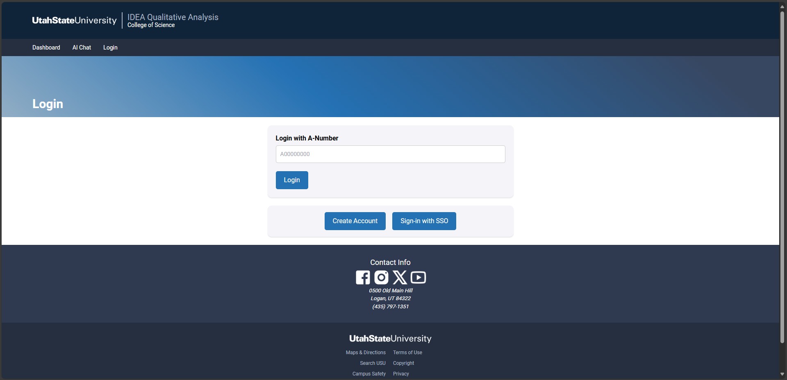
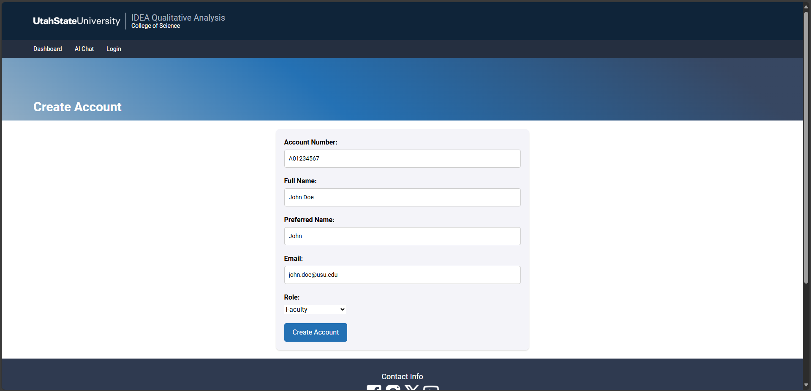
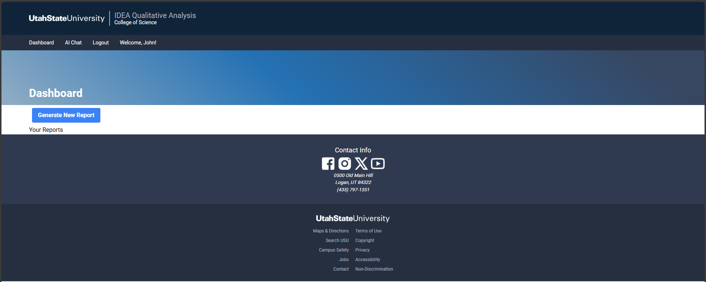
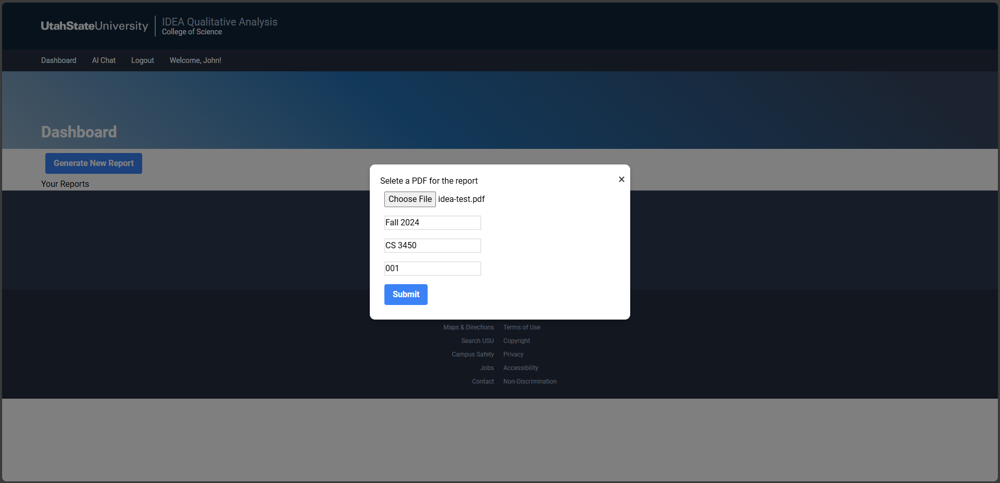
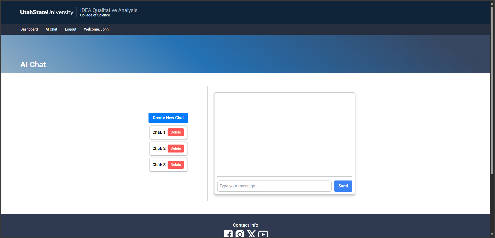
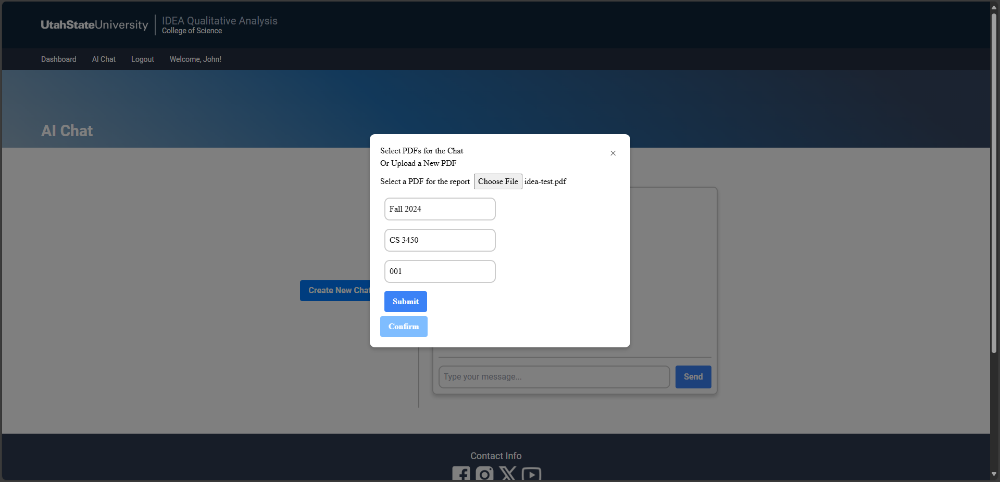
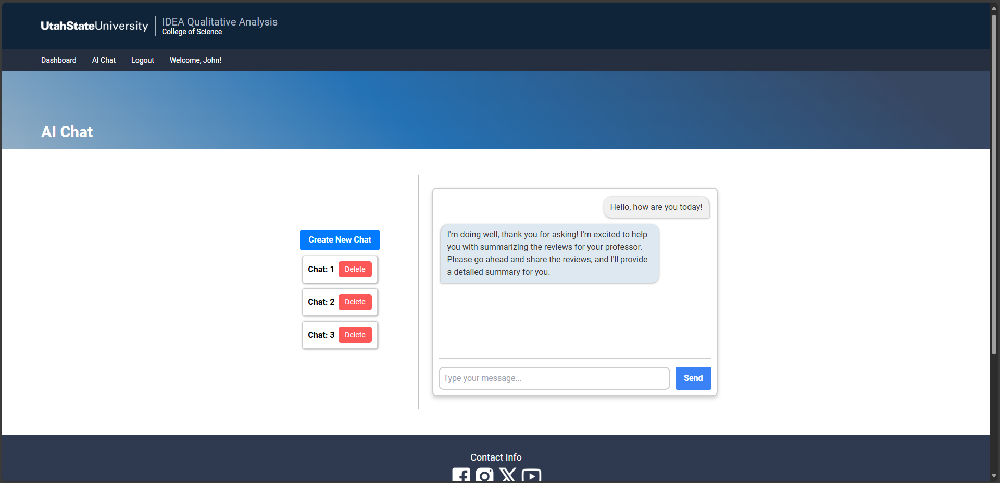

# IDEA Ideas User Manual

## Table of Contents
- [Introduction](#introduction)
- [Getting Started](#getting-started)
  - [Installation](#installation)
  - [Signing Up and Signing In](#signing-up-and-signing-in)
- [Website Navigation](#website-navigation)
    - [Navigation Bar](#navigation-bar)
    - [Dashboard (`/dashboard`)](#dashboard-dashboard)
        - [Uploading a PDF from the Dashboard](#uploading-a-pdf-from-the-dashboard)
        - [Accessing a Report](#accessing-a-report)
    - [AI Chat (`/chat`)](#ai-chat-chat)
        - [Creating a New Chat](#creating-a-new-chat)
    - [Report Page](#report-page)
- [Example Workflow](#example-workflow)
- [Common Issues](#common-issues)
- [Frequently Asked Questions (FAQs)](#frequently-asked-questions-faqs)

## Introduction
Welcome to the IDEA Ideas web application! This user guide will help you get started with using IDEA Ideas to help quickly process student feedback for your course!

## Getting Started

### Installation
If you are hosting this web application yourself, please consult the **[Installation Guide](Installation%20Guide.md)** on how to set up and run the application.

### Signing Up and Signing In
If you are self-hosting on your local machine, this web application can be accessed by going to **[`http://localhost:3000`](http://localhost:3000)**.

When you first go to the IDEA Ideas website, you will be automatically redirected to the login page ([`http://localhost:3000/login`](http://localhost:3000/login)). The login page will have several options, as can be seen in the screenshot below.

#### If you have a Utah State University (USU) account:
1. Click on the **Sign-in with SSO** button. You will be redirected to the USU sign-on portal.
    - If your web browser sends you to a page that says "Your connection isn't private" or gives a "Certificate Authority Invalid" error, please click on the **Advanced** button and the *Continue to localhost (unsafe)* link. This will allow you to access the USU SSO. 
2. Enter your USU credentials (A-Number and USU password) and complete the multi-factor authentication (MFA) challenge.
3. After entering your USU credentials and completing the MFA challenge, you will be signed-in and redirected to the IDEA Ideas website.

#### If you have an IDEA Ideas account:
1. Enter your A-Number (ex. `A01234567`) and click the **Login** button.

#### If you do *not* have an IDEA Ideas account or USU account:
1. Click on the **Create Account** button.
2. Fill out the `Account Number`, `Full Name`, `Preferred Name`, `Email`, and `Role` fields.
3. Click on the **Create Account** button to submit the form. 
    - If any information is invalid or if the account already exists, you will be presented with an error message asking you to sign-in with the account instead of trying to create it.
4. Upon the account being successfully created, you will be automatically logged-in and redirected to your `Dashboard` page.

## Website Navigation
### Navigation Bar
The navigation bar is present on each page of the IDEA Ideas website. The navigation bar has links to your `Dashboard` and `AI Chat` pages, as well as a `Logout` button. Clicking on the links will redirect you to their respective pages.

### Dashboard (`/dashboard`)
The `Dashboard` page is your personal home page for the IDEA Ideas website, and the page can be accessed by clicking on the `Dashboard` link in the navigation bar. From the `Dashboard` page, you can upload PDFs of IDEA course evaluations and see links to previously generated IDEA course survey reports.

#### Uploading a PDF from the Dashboard
From the `Dashboard` page, you can upload a PDF for your IDEA survey by clicking on the **Generate New Report** button. After clicking on the button, you will be presented with a popup box that will ask you to upload a PDF and enter the PDF details (school year, class name, class section). After uploading the PDF and entering the details, click on the **Submit** button.

#### Accessing a Report

### AI Chat (`/chat`)
The `AI Chat` page is the main page from which you can consult with your own personal AI chatbot about a specific course evaluation PDF. When you go to the `AI Chat` page (by clicking on the link in the navigation bar), you will see all (if any) previous chats that you have had.

To select an existing chat, click on the chat name. To delete an existing chat, click on the **Delete** button next to the chat name.

#### Creating a New Chat
To create a new chat, click on the **Create New Chat** button. You will be presented with a popup box that will ask you to select or upload a PDF to use for the new chat. After selecting the correct PDF, click on the **Confirm** button.

After you have selected or created your chat, you can ask the AI chatbot questions about the selected course evaluation PDF by entering your message into the box that says *Type your message*. After typing out your message, click on the **Send** button and wait for the AI's response!

### Report Page

## Example Workflow
I am a USU faculty member who would like to get a quick summary of my students' written feedback from an IDEA survey. Here is how I would use IDEA Ideas:

1. I will open up the IDEA Ideas website (`http://localhost:3000`).
2. After being automatically directed to the Login page, I will click on the **Sign-in with SSO** button.
3. After being directed to the USU Sign-on page, I will sign-in with my USU username (`john.doe@usu.edu`) and USU password.
4. After logging-in and completing the MFA challenge, I will be directed to my IDEA Ideas Dashboard.
5. From the Dashboard page, I will click on the **Generate New Report** button and upload the IDEA survey PDF.

(Finish workflow example)

## Common Issues
- After uploading a PDF to your Dashboard, it make take some time for the PDF to be processed and the report generated. Please be patient and wait on the Dashboard page until the report is generated.

## Frequently Asked Questions (FAQs)