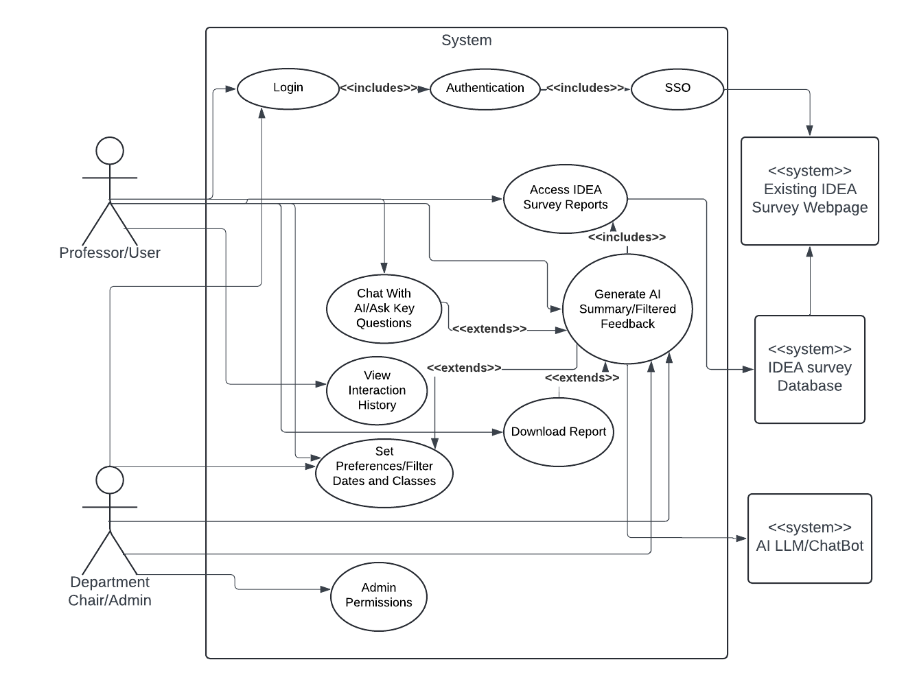

# Introduction

## Project Overview

The project aims to provide faculty at Utah State University (USU) with enhanced insights from their IDEA survey reports. IDEA surveys are conducted at the end of each semester, where students rate and comment on their courses and instructors. This project leverages artificial intelligence to summarize student comments over a selected timeframe and set of classes, delivering three key insights to professors:

1. An overview of the general comments.
2. Highlights of what was done well during the semester.
3. Recommendations for improvement.

The system will integrate seamlessly with existing USU systems, allowing professors to log in and generate AI-driven analyses of their IDEA survey reports. Additionally, professors will have the option to ask specific questions to the AI, such as "What do students think about the fairness of my quizzes?" or "How difficult is my class?" to gain deeper insights into student perceptions.

## Stakeholders

Who is impacted by this tool?

0. **USU Office of Data & Analytics**: This office is sponsoring the development of this tool and will own the business operations of the tool once launched. As such, design decisions concering this tool directly impact the Office of Data & Analytics.
1. **USU Faculty**: professors, instructors, and department heads at USU will form the end userbase of this tool at launch. The behavior of this tool will directly impact the workflow of faculty members using the tool to accomplish tasks they are responsible for.
2. **University Administration**: It is anticipated that reports generated using this tool will be circulated through and reviewed by various offices at USU. As such, the format and content of reports will directly impact University Administration. It is also anticipated that this tool will increase compliance with university policies concerning course evaluation by professors. As such, the availability of this tool will be of interest to University Administration.
3. **USU Student Body**: It is anticipated that insights generated from this tool will inform decisions that impact student life. As such, students are indirectly impacted by the rollout of this tool. Although students are not part of the end userbase at launch, their data will be processed by this system. As such, data handling practices will be of interest to students.

## Purpose of Requirements Document

The purpose of this requirements document is to clearly outline the specifications and expectations for the development of the AI-driven analysis system for IDEA survey reports at Utah State University (USU). This document serves as a comprehensive guide for all developers, faculty members, and Erik Falor ensuring that everyone involved has a clear understanding of the project's objectives, functionalities, and constraints. By detailing the functional, non-functional, technical, and user requirements, this document aims to facilitate effective communication, minimize ambiguities, and provide a solid foundation for the successful implementation and deployment of the system.

# Requirements

## Functional Requirements

1. **Authentication and Access Control**
  - The system shall allow professors to log in using Utah State University's Single Sign-On (SSO) for secure authentication. **(M)**
    - As a professor, I want to log in using my university SSO credentials so that I can securely access my IDEA reports without needing to remember another password.
  - The system shall ensure that professors can only access their own IDEA survey reports after logging in. **(M)**
    - As a professor, I want to securely log in using my USU SSO credintials, ensuring only I have access to my own IDEA reports.
  - The system shall provide an admin or overseer with permission-based access to the IDEA reports of professors they oversee. **(S)**
    - As a department chair, I want to access the IDEA reports of the professors I oversee so that I can monitor their performance and provide support.

2. **AI-Powered Summarization**
  - The system shall generate AI-generated summaries of student feedback from external PDFs, focusing on qualitative comments. **(M)**
    - As a professor, I want to generate comprehensive summaries of qualitative feedback from my IDEA survey reports so that I can quickly understand overall student feedback.
  - The system shall provide answers to specific key questions, such as:
    1. "What is the general overview of the comments?" **(M)**
    2. "What did I do well?" **(M)**
    3. "What can I do better?" **(M)**
    - As a professor, I want the system to answer key questions like "What is the general overview of the comments?", "What did I do well?", and "What can I do better?" so that I can quickly understand and improve my teaching.
  - Allow the user to chat directly to the AI/input custom questions. **(C)**
    - As a professor, I want to engage in a chat about specific sections of the report so that I can ask targeted questions and receive detailed insights.
  - Store a history of interactions with the chatbot for reference and review. **(S)**
    - As a professor, I want to store a history of my interactions with the chatbot so that I can refer back to previous conversations and insights.

3. **Filtering and Reporting**
  - The system shall allow professors to filter feedback by class and time period. **(M)**
    - As a professor, I want to filter feedback by specific classes and time frames so that I can perform targeted analysis on my teaching performance.
  - The system shall support the aggregation of multiple IDEA reports over different time periods to detect trends. **(M)**
    - As a professor, I want to aggregate multiple reports to identify trends over time so that I can track my teaching progress and make informed decisions.
  - The system shall generate a summary report in PDF format based on selected classes and time frames. **(M)**
    - As a professor, I want to generate automatic printable reports as PDFs based on specified timelines and selected classes so that I can easily share or archive my feedback summaries.
  - The system shall allow users to download reports in formats like PDF, CSV, and DOCX. **(S)**
    - As a professor, I want to download reports in multiple formats like PDF, CSV, and DOCX so that I can use them in various applications or share with others.
  - Include citations of specific comments used by the AI to generate insights for transparency. **(S)**
    - As a professor, I want the system to include citations of specific comments used to generate insights so that I can understand how the summary was created.

4. **Content Moderation and Filtering**
  - The system shall filter out inappropriate or aggressive comments from the AI-generated summaries to protect the emotional well-being of professors. **(M)**
    - As a professor, I want aggressive or inappropriate comments filtered out so that I can review student feedback without unnecessary stress.
  - Ability to toggle moderation filter **(C)**
    - As a professor, I want to toggle the moderation filter on or off so that I can choose to view all comments or only filtered comments.

5. **Report Generation and Downloading**
  - The system shall generate printable reports that can be downloaded in PDF format. **(M)**
    - As a professor, I want to generate printable reports that can be downloaded in PDF format so that I can easily share or archive my feedback summaries.
  - The system shall include the initial prompt used to generate each report to maintain transparency. **(M)**
    - As a professor, I want the system to include the prompt used to generate the initial report so that I can understand how the summary was created.

## Non-Functional Requirements

1. **User-Friendly and Accessible**
  - The system will provide an intuitive user interface, making it easy for professors to access, filter, and download their reports without requiring technical expertise. **(M)**
    - As a professor who is not tech-savvy, I want the system to be user-friendly and intuitive so that I can easily navigate and use it without technical difficulties.
  - The system will provide useful and informative error messsages. Any errors will be handled by the system, and users will be guided to available support resources. **(S)**
    - As a professor, I want the system to provide informative error messages so that I can understand and resolve issues quickly.
  - The system will be accessible as a website that is supported across all major web browsers. Mobile devices will be supported. **(S)**
    - As a professor, I want to access and interact with the system on my mobile device or unccommond browser choice so that I can review feedback in a convenient manner.
  - The website will be compliant with all relevant accessiblity standards and guildlines set out by Utah State University. **(S)**
    - As a professor, I want the system to be accessible and compliant with USU standards so that I can use it without any barriers.

2. **Data Privacy and Data Governance Compliance**
  - The system will comply with relevant data privacy regulations (such as FERPA) and university policies to protect sensitive information. **(M)**

3. **System Security**
  - The system will implement website security measures to ensure no unauthorized access to functions or user data. **(M)**
    - As a professor, I want the system to be secure so that my feedback reports are protected from unauthorized access.

4. **System Performance**
  - The system will be optimized to provide the user with a smooth and consistent experience. **(S)**
    - As a professor, I want the system to be fast and responsive so that I can quickly access and analyze my feedback reports.

## Business Requirements
1. **Analytics**
  - User Engagement Tracking: Dashboard/Logs to track what users log on and how often **(C)**
    - As a department chair, I want to see which professors are active and using the platform so that I can provide oversight and encourage engagement.

2. **Security**
  - Accessiblity: Limit user accessiblity to only their own surveys **(M)**
    - As a professor, I want to ensure that only I can access my own feedback reports to maintain privacy and confidentiality.

3. **Platform**
  - Mobile App: Access and interact with the system on-the-go **(C)**
    - As a professor, I want to access and interact with the system on my mobile device so that I can review feedback in a convenient manner.
  - Integration: Ability to merge into exsting USU websites **(C)**
    - As an admin, I want the system to integrate seamlessly with existing USU websites so that professors can easily access their feedback reports.
  - Design: The program will be designed to fit the USU brand **(S)**
    - As a professor, I want the system to be designed to fit the USU brand so that it feels familiar and trustworthy.

4. **Admin**
  - Superiors: Super Users given move visibility into the IDEA surveys of users they mannage **(C)**
    - As a department chair, I want to have access to the IDEA reports of the professors I oversee so that I can provide guidance and support.

## User Requirements
1. **Access to IDEA Reports**
  - As a professor, I want to securely log in using my USU SSO credintials, ensuring only I have access to my own IDEA reports. **(M)**
  - As a department chair or admin, I want permission-based access to the IDEA reports of the professors I oversee, so I can provide guidance and support. **(S)**
2. **AI-Driven Feedback Summarization**
  - As a professor, I want to generate AI-driven summaries of student feedback, focusing on general overviews, positive aspects, and areas for improvement, so I can quickly assess my teaching performance. **(M)**
  - As a professor, I want the AI to answer specific questions like "How fair are my quizzes?" or "What do students think about the difficulty of my class?" to gain deeper insights from the data. **(C)**
3. **Comment Filtering and Data Customization**
  - As a professor, I would like to have a content moderation filter to control which reviews I want to see (Filter by positive, negative, length, vulgar language, etc.) **(C)**
  - As a professor, I want to filter feedback by specific classes and timeframes so that I can perform a targeted analysis. **(M)**
  - As a professor, I want to aggregate feedback from multiple reports to identify trends over time and track changes in my teaching effectiveness. **(M)**
4. **Data Reports**
  - As a professor, I want to download my summarized feedback reports in multiple formats, such as PDF, CSV, and DOCX, for easy sharing and record-keeping. **(S)**
5. **User Interface and Ease of Use**
  - As a professor who is maybe not tech-savvy, I want a user-friendly and intuitive system that I can navigate without difficulty. **(M)**
  - As a professor, I want mobile support (Where reasonable to implement) for accessing feedback on-the-go, so I can review insights from anywhere. **(C)**
6. **Interaction and Feedback Transparency**
  - As a professor, I want the prompt used to generate the report - as well as the ability to edit this prompt - included for transparency, so I understand the context of the analysis. **(M)**
7. **Security and Data Privacy**
  - As a professor, I want the system to comply with university data privacy policies and FERPA regulations, so I can trust that my feedback is handled responsibly and securely. **(M)**

# Won't Do
  - Students and the general public will not have access to the reports.
  - Quantitative reporting or analysis features will not be included or reported on.
  - Concerns regarding prompt engineering from professors will not be addressed.

# Use Case Diagram

